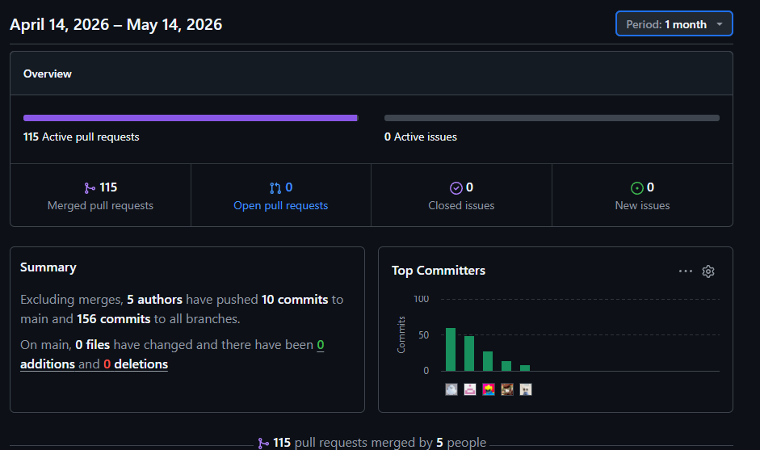

{width=300px height=300px}

# Universidad Peruana de Ciencias Aplicadas

## Facultad de Ingeniería

## Programa Académico de Ingeniería de Software

**Ciclo:** 2026-10  

**Código del curso:** 1ASI0729

**Curso:** Desarrollo de Aplicaciones Open Source

**NRC:** 11881

**Docente del curso:** Efraín Ricardo Bautista Ubillús

---

# Informe de Trabajo Final

**Nombre de la Startup:** SpotTrack  

**Nombre del producto:** SpotTrack

---

## Integrantes

u20241d317 - Atoche Gonzales, Nicolas Fernando 
u202411310 - Azama Fukuda, Juan Pablo 
u202413214 - Jesús Miguel Cataño Zárate 
u202414928 - Alvaro Sebastian Fernanadez Linares 
u202410344 - Valentino Andre Espinoza Orrego 
---

*Abril, 2026*

---

# Registro de Versiones del Informe

| Versión | Fecha | Autor | Descripción de modificación |
|--------|------|------|-----------------------------|
|1.0.0 | 25/04/26 | Azama, Atoche, Cataño, Espinoza, Fernández | Se realizaron todos los incisos realizados a Lean UX, Needfidining, UI/UX Design y DDD|
|2.0.0 | 10/05/26 | Azama, Atoche, Cataño, Espinoza, Fernández | Se completó el despliegue de la Landing Page en GitHub Pages con todas sus secciones (Hero, Features, Pricing, Contact, Footer). Se implementó el desarrollo frontend de la Web Application en Angular con Fake RESTful API (JSON Server desplegado en Azure), cubriendo los bounded contexts de Equipment, IoT Monitoring, Heatmap, Authentication, Maintenance, Analytics, Routines y Booking. Se documentó el Sprint 2 Planning, Aspect Leaders, Sprint Backlog, Development Evidence, Services Documentation y Software Deployment Evidence. Se aplicó la corrección de artefactos pendientes del Sprint 1, incluyendo diagrama ERD, diagrama de clases, Big Picture EventStorming, evidencias de colaboración y estandarización de entrevistas. Se incorporaron las secciones de Conclusiones y Recomendaciones para ambos sprints. |

---

## Project Report Collaboration Insights

URL del Repositorio spottrack-report: (https://github.com/SpotTrack-1ASI0729-2610-11881/spottrack-report.git)

---

\tableofcontents

---

## Student Outcome
| Criterio específico                                                        | Acciones realizadas                                                                                                                                                                                                                                                                                                                                                                                                                                                                                                                                                                                                                                                                                                                                                                                                                                                                                                                                                                                                                                                                                                                                                                                                                                                                                                                                                                                                                                                                                                                                                                                                                                                                                                                                                                                                                                                                                                                                                                                                                                                                                                                                                                                                                                                                                                                                                                                                                                                                                                                                                                                                                                                                                                                                                                                                                                                                                                                                                                                                                                                                                                                                                                                                  | Conclusiones                                                                                                                                                                                                                                                                                                                                                                                                                                                                                                                                                                                                                                                                                                       |
| :------------------------------------------------------------------------- | :------------------------------------------------------------------------------------------------------------------------------------------------------------------------------------------------------------------------------------------------------------------------------------------------------------------------------------------------------------------------------------------------------------------------------------------------------------------------------------------------------------------------------------------------------------------------------------------------------------------------------------------------------------------------------------------------------------------------------------------------------------------------------------------------------------------------------------------------------------------------------------------------------------------------------------------------------------------------------------------------------------------------------------------------------------------------------------------------------------------------------------------------------------------------------------------------------------------------------------------------------------------------------------------------------------------------------------------------------------------------------------------------------------------------------------------------------------------------------------------------------------------------------------------------------------------------------------------------------------------------------------------------------------------------------------------------------------------------------------------------------------------------------------------------------------------------------------------------------------------------------------------------------------------------------------------------------------------------------------------------------------------------------------------------------------------------------------------------------------------------------------------------------------------------------------------------------------------------------------------------------------------------------------------------------------------------------------------------------------------------------------------------------------------------------------------------------------------------------------------------------------------------------------------------------------------------------------------------------------------------------------------------------------------------------------------------------------------------------------------------------------------------------------------------------------------------------------------------------------------------------------------------------------------------------------------------------------------------------------------------------------------------------------------------------------------------------------------------------------------------------------------------------------------------------------------------------------------- | :----------------------------------------------------------------------------------------------------------------------------------------------------------------------------------------------------------------------------------------------------------------------------------------------------------------------------------------------------------------------------------------------------------------------------------------------------------------------------------------------------------------------------------------------------------------------------------------------------------------------------------------------------------------------------------------------------------------- |
| **Comunica oralmente con efectividad a diferentes rangos de audiencia.**   | **Azama Fukuda, Juan Pablo** **AV1:** Dirigí las sesiones de sincronización del equipo, explicando la visión del proyecto y asignando responsabilidades para la estructuración inicial de Lean UX y la arquitectura de la Landing Page. Articulé las metas del Sprint Planning de manera clara para alinear el trabajo del equipo de desarrollo. **TB1:** Lideré la reunión de Sprint 2 Planning, exponiendo ante el equipo la estrategia dual de trabajo: correcciones del Sprint 1 en paralelo al inicio del desarrollo del frontend Angular. Presenté la arquitectura de carpetas por Bounded Context (`auth/`, `heatmap/`, `equipment/`, `maintenance/`) y argumenté su alineación con el Domain-Driven Design previamente modelado. Expliqué asimismo el funcionamiento del JSON Server desplegado en Azure como Fake API compartida, articulando cómo una URL pública elimina problemas de integración entre entornos de desarrollo.  **Atoche Gonzales, Nicolas Fernando** **AV1:** Lideré la exposición técnica de la arquitectura de contenedores (C4 Model) ante el equipo de desarrollo, detallando la integración entre los nodos IoT Edge y el backend en Spring Boot. Expliqué la lógica de los triggers de auditoría en SQL Server para asegurar que los stakeholders comprendieran los mecanismos de integridad de datos. **TB1:** Participé activamente en las reuniones de planificación del Sprint 2, asumiendo responsabilidades en backend e infraestructura. Me encargué del despliegue del Mock API en Azure como App Service, garantizando una URL pública estable para la integración frontend. Desarrollé los bounded contexts y corregí la nomenclatura de la base de datos para alinearla con los estándares del proyecto. Asimismo, comuniqué mis avances y bloqueos técnicos de manera oportuna para facilitar la coordinación entre equipos.  **Espinoza Orrego, Valentino Andre** **AV1:** Expuse los resultados del análisis del problema, entrevistas y validación de la solución, adaptando el mensaje tanto para usuarios finales como para administradores de gimnasios. Expliqué el valor de la propuesta (mapas de calor, IoT y mantenimiento predictivo), facilitando la comprensión técnica y comercial según la  **TB1:** Participé en la explicación y validación de wireframes, mockups, user flows y prototipos de la aplicación web, comunicando de forma clara las decisiones de diseño y navegación tanto al equipo técnico como a usuarios relacionados con el proyecto. Además, durante la implementación de la landing page UI Design, adapté la explicación de funcionalidades y flujos según el tipo de audiencia, facilitando la comprensión de la propuesta visual y funcional del sistema.  **Fernández Linares, Alvaro Sebastian** **AV1:** Dirigí las sesiones de diseño y estructuración del frontend, sustentando las decisiones de Interfaz de Usuario (UI) ante el equipo de desarrollo. Expliqué de forma clara la aplicación de principios Lean UX y evaluaciones heurísticas, adaptando el lenguaje para asegurar la comprensión de los requerimientos de negocio de SpotTrack. **TB1:** Durante las reuniones de planificación y sincronización del equipo, expuse la estrategia de desarrollo e integración para los Bounded Contexts asignados (`alerts`, `reservation`, `dashboard`) dentro de la WebApp. Argumenté la importancia de priorizar `reservation` como Core Domain de la solución y expliqué la estrategia de mitigación para las correcciones del Sprint 1, detallando además el flujo de navegación y redirección entre la Landing Page y la WebApp desplegada en Azure.   **Cataño Zárate,Jesús Miguel** **AV1** Dirigi la segmentacion del trabajo en microtareas con Trello, maneje el blindaje de repositorios apoyando a mis compareños en la orientacion de los convetional commits, ademas de apoyar en la revision del documento.  **TB1:** Durante las reuniones de planificacion, aporte en el desarrollo de la Landing page (`Contact section`,`footer section`), en la web app desarrolle las secciones asignadas (`profile`, `alerts`). Ademas de testear y comunicar los cambios requeridos de otras partes del documento y aplicacion | Se logró establecer una comunicación oral efectiva que permitió articular con claridad la visión técnica y comercial de SpotTrack. A través de sesiones de planificación, exposiciones de arquitectura, validaciones con usuarios y sustentación de decisiones de diseño UI, el equipo demostró capacidad para adaptar el lenguaje a diferentes audiencias, tanto técnicas como administrativas y usuarios finales. Durante el TB1, esta competencia se fortaleció mediante la explicación de decisiones de arquitectura frontend, despliegue en Azure, integración mediante Fake APIs y organización basada en Domain-Driven Design, garantizando la alineación del equipo en los distintos frentes del Sprint 2. |
| **Comunica por escrito con efectividad a diferentes rangos de audiencia.** | **Azama Fukuda, Juan Pablo** **AV1:** Redacté y estructuré el documento *Sprint Planning 1*, documentando asignaciones de tareas y configuración del entorno de desarrollo. Desarrollé la arquitectura de información utilizando Markdown y jerarquías visuales para facilitar la lectura técnica. **TB1:** Redacté el *Sprint 2 Planning*, la tabla de *Aspect Leaders* y el *Sprint Backlog*, documentando tareas CORR, SETUP, User Stories y Technical Stories con estimaciones, responsables y estados. Documenté además el pipeline CI/CD en GitHub Actions para el despliegue de la Landing Page y la WebApp, así como los endpoints del Mock API y las URLs de producción.  **Atoche Gonzales, Nicolas Fernando** **AV1:** Documenté la arquitectura de software bajo estándares de Domain-Driven Design (DDD) y el modelo C4. Redacté especificaciones técnicas de procedimientos almacenados y triggers de base de datos, además de estructurar las User Stories técnicas enfocadas en persistencia y analítica. **TB1:** Documenté los endpoints del Mock API desplegado en Azure, detallando rutas, métodos HTTP y ejemplos de respuesta para facilitar el consumo por parte del frontend. Corregí la documentación de la base de datos y actualicé el diagrama C4 del backend para reflejar correctamente los contenedores y sus interacciones tras los ajustes de despliegue.  **Espinoza Orrego, Valentino Andre** **AV1:** Documenté de manera estructurada el proceso de segmentación, entrevistas, user personas, journey maps y requerimientos. Elaboré entregables como el análisis competitivo y el glosario, asegurando claridad tanto para perfiles técnicos como de gestión.  **TB1:** Documenté y estructuré los wireflow diagrams, user flows y prototipos de la aplicación web para representar de manera clara la lógica de navegación y experiencia de usuario del proyecto. Asimismo, apoyé en la elaboración y organización de contenidos relacionados con el diseño e implementación de la landing page, asegurando una comunicación escrita comprensible tanto para el equipo de desarrollo como para stakeholders no técnicos.  **Fernández Linares, Alvaro Sebastian** **AV1:** Redacté y estructuré la documentación de experiencia de usuario utilizando Markdown y jerarquías visuales. Elaboré artefactos de diseño como guiones de entrevistas, User Flows y Wireframes para servir como guía de implementación técnica. **TB1:** Documenté la estructura e implementación de los Bounded Contexts (`alerts`, `reservation`, `dashboard`) dentro de la WebApp, detallando responsabilidades y componentes para asegurar la mantenibilidad del sistema. También redacté el reporte de correcciones del Sprint 1 y la documentación relacionada con el flujo de integración y despliegue entre la Landing Page y la infraestructura en Azure.   **Cataño Zárate, Jesús Miguel** **AV1:** Documenté y estructuré las microtareas en el tablero de Trello, redactando descripciones claras y criterios de cumplimiento para el equipo. Además, redacté las guías de uso de *conventional commits* para estandarizar el historial del repositorio en GitHub y dejé retroalimentación escrita y estructurada durante la revisión del documento principal para asegurar su legibilidad técnica. **TB1:** Redacté el detalle técnico y la documentación de los *pull requests* correspondientes a las secciones implementadas en la Landing Page (`Contact section`, `footer section`) y la WebApp (`profile`, `alerts`). Asimismo, reporté por escrito los hallazgos de las sesiones de testing, documentando de manera precisa las incidencias y los cambios requeridos en el documento y la aplicación para facilitar el seguimiento asíncrono por parte de los desarrolladores. | La documentación elaborada destacó por su rigor profesional, precisión técnica y enfoque orientado al usuario. La combinación de diagramas arquitectónicos complejos (C4, DDD), artefactos UX (Journey Maps, Personas, User Flows y Wireframes) y documentación técnica permitió consolidar una única fuente de verdad para el proyecto. Durante el TB1, esta competencia se fortaleció mediante la documentación de pipelines CI/CD, despliegues en Azure, endpoints del Mock API y backlog técnico, evidenciando la capacidad del equipo para comunicar información técnica compleja de manera clara y comprensible para distintos tipos de audiencia.                                                           |
