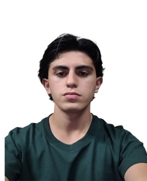

# Capítulo I: Introducción

## Startup Profile

### Descripción de la Startup

**Descripción general:**
SpotTrack nace para cerrar la brecha entre la gestión tradicional de recintos deportivos y la innovación tecnológica impulsada por el Internet de las Cosas (IoT). Somos una startup comprometida con la optimización de los activos físicos y la mejora de la experiencia del usuario en gimnasios, asegurando que la toma de decisiones basada en datos reemplace a la intuición, maximizando la rentabilidad y la satisfacción del cliente.

**Misión:**
La misión de SpotTrack es ofrecer un servicio inteligente de monitoreo y analítica de uso de equipos deportivos, orientado a gimnasios y centros de fitness universitarios. Buscamos optimizar sus procesos operativos y de mantenimiento mediante el uso de IoT (cámaras con visión computacional y sensores en el Edge) para transformar el uso físico de las máquinas en datos accionables gestionados eficientemente en la nube.

**Visión:**
La visión de SpotTrack es ser la plataforma líder en telemetría y gestión de activos deportivos en Perú, promoviendo una administración moderna y predictiva que impulse a los gimnasios hacia una transformación digital eficiente y a la vanguardia de la tecnología.

### Perfiles de integrantes del equipo

Soy **Juan Pablo Azama Fukuda** (Código: u202411310), estudiante de quinto ciclo de Ingeniería de Software. En el ámbito técnico, poseo una base sólida en lenguajes como C++, Java y Unity. Para este proyecto, mi contribución principal tendrá un foco en la parte de diseño/frontend de la aplicación, tanto en la aplicación web y el landing page. Para ello, me respaldo en mis conocimientos decentes en Figma, HTML y CSS, además de mi manejo de React.js, competencias que seguiré escalando a lo largo del curso. A nivel de gestión, asumo el rol de team leader, con la responsabilidad de articular los esfuerzos del equipo, guiar el desarrollo y garantizar una metodología de trabajo eficiente.

Soy **Alvaro Sebastian Fernanadez Linares** (codigo: u202414928), estudiante de 5to ciclo de Ingeniería de Software. Cuento con un nivel intermedio en C++ y bases sólidas en Java, lenguajes que me han permitido especializarme en el desarrollo backend, enfocándome en la lógica de negocio y la funcionalidad del servidor. Me defino como una persona responsable, organizada y con una fuerte orientación al trabajo en equipo y la eficiencia. Para este ciclo, mi objetivo en Desarrollo de Aplicaciones Open Source es trasladar mi experiencia en desarrollo estructurado hacia entornos colaborativos. Aspiro a integrar mis habilidades técnicas con la filosofía de código abierto para crear soluciones que no solo sean eficientes, sino también accesibles y transparentes, entendiendo que el futuro de la ingeniería de software se construye colectivamente.

Soy **Valentino Andre Espinoza Orrego** (código: u202410344), "Estudiante de Ingeniería de Software en la UPC apasionado por la tecnología y el aprendizaje constante. Me especializo en potenciar mis capacidades técnicas y analíticas, trabajando colaborativamente para resolver problemas con eficiencia. Busco oportunidades prácticas donde aplicar mis conocimientos, contribuir responsablemente y desarrollar soluciones funcionales de alto impacto

Soy **Nicolas Fernando Atoche Gonzales**, actualmente estoy en el tercer ciclo de la carrera de ingeniería de software. Poseo un conocimiento básico/intermedio en programación con C++, java y Lua. Además, cuento con conocimientos en el desarrollo de videojuegos. Dentro del equipo, estoy encargado en el desarrollo del backend  del proyecto utilizando el entorno Angular. A su vez suelo orientarme por el conocimiento y el pensamiento lógico, con lo cual suelo buscar la solución más óptima y ágil dentro de un problema a través de pasos sencillos y definidos que construyan una base sólida donde pueda desarrollar respuestas claras y efectivas.

Soy **Jesús Miguel Cataño Zárate**, (Codigo: u202413214). Actualmente estudio el 5to ciclo de Ingeniería de Software. Cuento con un nivel intermedio en C++,C# y experiencia usando Java, para desarrollos moviles y HTML,JS,Node.Js en cuanto a paginas web. 
Mi aporte al equipo, a nivel técnico, contribuyo en el desarrollo creación de arquitecturas escalables y eficientes. Por otro lado, desempeño el rol de Team Leader dentro de mi grupo, asumiendo la responsabilidad de guiar y coordinar al equipo para trabajar de manera efectiva.

## Solution Profile

### Antecedentes y problemática

La gestión operativa y el mantenimiento de equipos en centros deportivos representan un desafío crítico en la actualidad. Una administración deficiente, caracterizada por el desconocimiento del estado real y la disponibilidad de las máquinas, desencadena consecuencias operativas y financieras severas para las empresas. De acuerdo con ResQ (s.f.), cuando se producen fallas repentinas en los equipos por falta de monitoreo, los costos de reparación suelen ser entre 3 y 5 veces más altos en comparación con los gastos de un mantenimiento preventivo programado.

Además del impacto económico directo, la experiencia del cliente se ve profundamente perjudicada. El 70% de los usuarios finales manifiesta una alta insatisfacción al descubrir que su máquina preferida se encuentra averiada en el momento de su entrenamiento (Athletic Business, 2024, como se citó en DINGG, 2025). Esta falta de visibilidad impide que los usuarios organicen su tiempo adecuadamente, generando desánimo e incrementando significativamente la probabilidad de que cancelen sus suscripciones. Paralelamente, para la administración del establecimiento, esta carencia de información centralizada y en tiempo real se traduce en una planificación de mantenimiento ineficiente y en una toma de decisiones imprecisa respecto a la reubicación, reparación o compra de nuevos equipos.

**What (Qué):**

El problema es la baja administración que se le dan a las máquinas, de tal manera que se ignoran el estado y disponibilidad de estas. Según ResQ (s.f), las fallas repentinas de las máquinas ocasionan que los costos de reparación sean 3 o 5 veces más caros de lo normal. Por otro lado, el 70% de usuarios finales muestran insatisfacción cuando su máquina preferida está dañada (Athletic Business, 2024, como se citó en DINGG, 2025).
Esto repercute en que los usuarios finales no tengan la capacidad de organizar su tiempo adecuadamente al no saber si una máquina está disponible o si está en mantenimiento. Incluso, es posible que se desanimen y cancelen su suscripción. Por otro lado, con respecto a la administración, la planificación del mantenimiento y la toma de decisiones fundamentadas sobre la compra o reubicación de equipos termina siendo imprecisa.
https://dingg.app/blogs/your-5-step-operational-plan-to-handle-equipment-failures

**When (Cuándo):**

El problema surge y se intensifica drásticamente durante las "horas pico" de los gimnasios (generalmente temprano por la mañana y después de las 6:00 PM). En estos momentos, los usuarios deben lidiar con instalaciones abarrotadas y disputar el uso de máquinas populares (como trotadoras o racks de sentadillas), lo que implica tiempos de espera que rompen el ritmo de sus entrenamientos.
Desde la perspectiva administrativa, el problema del mantenimiento surge de forma imprevista. Las roturas de cables o fallos de motor en máquinas cardiovasculares ocurren súbitamente en medio de la operación diaria, obligando a poner carteles de "Fuera de Servicio" que generan malestar general.

**Where (Dónde):**

El principal lugar donde se encuentran los mayores clientes potenciales sería en las cadenas de gimnasios de tamaño mediano y grande en Lima, así como en centros deportivos universitarios. Estos establecimientos poseen una gran cantidad de activos costosos distribuidos en espacios amplios y, en muchos casos, cuentan con múltiples sedes, lo que dificulta bastante el control manual de qué se usa, cuánto se usa y dónde hace falta más equipamiento.

**Who (Quién):**

El problema afecta principalmente a dos grupos bien definidos: los administradores de los gimnasios y los usuarios/clientes (feligreses del fitness).
Por un lado, los administradores y dueños lidian con presupuestos ajustados. Al no tener telemetría, deben adivinar cuándo hacer mantenimiento o qué máquinas comprar. Esto representa una gran dificultad operativa y un riesgo de pérdida económica por mala gestión de activos.
Por otro lado, los usuarios se ven directamente afectados por la falta de disponibilidad. Llegan al local y deben caminar por todo el recinto buscando una máquina libre, lo cual genera estrés y pérdida de tiempo.
La solución que proponemos está pensada para que los administradores utilicen un dashboard analítico que les alerte de mantenimientos y muestre estadísticas de uso. Asimismo, está diseñada para que los clientes, mediante una app móvil, puedan consultar la "temperatura" (disponibilidad) de las máquinas en tiempo real antes de salir de casa o mientras están en el local.

**Why (Por qué):**

En primer lugar, la principal causa del problema es la carencia de sistemas de telemetría e IoT en los gimnasios tradicionales. La gestión se basa en la observación visual de los entrenadores y en reportes manuales cuando algo ya falló. Esto puede confirmarse gracias a MantainNow (2025), un error común de las organizaciones es que el mantenimiento que se realiza es reactivo. Es decir, se efectúa una vez el daño ya está hecho.

https://www.maintainnow.app/learn/guides/mro-maintenance-repair-operations-a-practical-guide

En segundo lugar, otro factor es la incapacidad de procesar datos de flujo de personas en tiempo real. Aunque algunos gimnasios tienen torniquetes de ingreso, esto solo indica cuánta gente hay en el local, pero no indica qué están usando. En consecuencia, la gestión de la capacidad se vuelve deficiente, haciendo que los clientes pierdan tiempo y que los administradores presenten dificultades para optimizar sus locales. Esto lo confirma Rework (s.f), en donde menciona que el aforo no debería percibirse por cantidad si no por acumulación de usuarios en las máquinas. O sea, 78 personas pueden encontrarse dentro de un local con un aforo de 100 personas. No obstante, estas se agruparán en máquinas específicas, dejando el resto con un porcentaje de uso significativamente menor.

**How (Cómo):**

La plataforma funcionará mediante un sistema dual (Web App para usuarios y Dashboard para administradores) alimentado por dispositivos IoT. En las instalaciones se utilizarán cámaras simples con reconocimiento en el Edge (o sensores de uso) que solo enviarán datos de estado (Ocupado/Libre) y tiempo a nuestra base de datos, respetando la privacidad (no se graba video).
La mayoría de los clientes preferirán acceder mediante dispositivos móviles, por lo que la interfaz en Angular será responsiva. Verán un catálogo de máquinas agrupadas por tipo (Cardio, Pesas, etc.) con indicadores de colores (ej. Verde: Libre, Rojo: Ocupado) como un mapa de calor.
Los administradores ingresarán mediante un login seguro (JWT) a un panel donde visualizarán gráficos de barras de uso histórico, alertas de "Mantenimiento requerido (Límite de 500 horas superado)", y recomendaciones para reubicar equipos poco usados.

**How much (Cuánto):**

La ineficiencia en la gestión de activos dentro de los centros fitness desencadena un impacto financiero que compromete severamente la rentabilidad del negocio. En primer lugar, la dependencia de un modelo reactivo infla el Sobrecosto Operativo (OPEX), dado que la ejecución de mantenimientos correctivos de emergencia resulta entre 3 a 5 veces más costosa que una estrategia preventiva planificada (Oxmaint, 2023). Este sobrecosto se agrava con la Depreciación Acelerada de Activos (CAPEX) considerando que el equipamiento cardiovascular comercial exige inversiones iniciales de $3,000 a $8,000 USD por unidad (Top Fitness, 2024), una falla correctiva mayor (como el reemplazo de un motor AC por fricción) puede consumir hasta el 40% de su valor residual, fulminando el Retorno de Inversión (ROI) proyectado. Finalmente, esta precariedad logística golpea el indicador más crítico: la retención. Con una tasa de abandono (Churn Rate) anual de la industria que oscila entre el 30% y el 40%, la inoperatividad de los equipos y la consecuente congestión de los locales se posicionan consistentemente en el "Top 3" de motivos de cancelación (Energym, 2023). Sabiendo que el Costo de Adquisición de Clientes (CAC) es 5 veces mayor que el costo de retenerlos (IHRSA, 2023), el downtime constante de las máquinas puede convertirse en una fuga de capital insostenible.

Energym. (2023). *Why do gym members cancel their memberships?* https://energym.io/blogs/braingains/why-do-gym-members-cancel-their-memberships

Oxmaint. (2023). *Corrective vs. preventive work orders*. https://www.oxmaint.com/blog/post/corrective-vs-preventive-work-orders

Top Fitness Store. (2024). *Commercial & professional treadmills*. https://www.topfitness.com/collections/commercial-treadmills

### Lean UX Process

#### Lean UX Problem Statements

Nuestro servicio ofrece una plataforma de telemetría y visualización en tiempo real para monitorear el uso, desgaste y disponibilidad de las máquinas de ejercicio. Hemos observado que los gimnasios enfrentan sobrecostos por mantenimientos reactivos y tiempos prolongados de equipos inoperativos, a la par que los usuarios experimentan largos tiempos de espera para entrenar durante las horas pico, reduciendo la tasa de retención. ¿De qué manera podemos visibilizar la ocupación y el estado de los activos para optimizar la planificación preventiva de la gerencia y permitir a los usuarios ejecutar sus rutinas sin tiempos muertos?

#### Lean UX Assumptions

**¿Quién es el usuario?**

Nuestros usuarios principales son los administradores/dueños de gimnasios y los usuarios finales (clientes). El administrador utilizará el sistema para ver reportes y alertas, mientras que el cliente lo usará para ver la disponibilidad en tiempo real.

**¿Dónde encaja nuestro producto en su trabajo o vida?**

Para el cliente, encaja en su rutina diaria de planificación de entrenamiento (antes de ir al gimnasio o mientras descansa entre series). Para el administrador, es una herramienta de gestión diaria y de planificación financiera mensual.

**¿Qué problemas tiene nuestro producto que resolver?**

La saturación de máquinas, la pérdida de tiempo de los usuarios, las averías imprevistas de equipos costosos y la mala distribución del inventario de máquinas entre diferentes locales.

**¿Cuándo y cómo es usado nuestro producto?**

Los clientes lo usarán en sus smartphones principalmente en horas pico o minutos antes de dirigirse al local. Los administradores lo usarán en computadoras de escritorio o tablets durante su jornada laboral para revisar el estado del local.

**¿Qué características son importantes?**

Mapa de calor de disponibilidad en tiempo real, registro automático de horas de uso vía IoT, notificaciones de mantenimiento predictivo, panel estadístico de máquinas más/menos usadas, e interfaz responsiva.

**¿Cómo debe verse nuestro producto y cómo debe comportarse?**

Debe tener un aspecto moderno, deportivo y ágil. Para los usuarios, debe ser extremadamente visual (uso de semaforización: verde, amarillo, rojo). Para los administradores, debe lucir como una herramienta profesional y gerencial (dashboards claros, tablas ordenadas y alertas visibles).

**Creo que mi cliente necesita** una mejora en la organización de sus tiempos de rutina y, por el lado administrativo, una reducción en costos de mantenimiento.

**Estas necesidades se pueden resolver con** la implementación de nuestra plataforma IoT de telemetría y mapas de calor.

**Nuestros clientes iniciales son** las cadenas medianas de gimnasios en Lima, regiones cercanas a Lima y centros deportivos universitarios.

**El mayor valor que prioriza** mi cliente (usuario) es no hacer filas; y para el administrador, maximizar la vida útil de sus activos y tener menos pérdidas.

**El cliente también puede obtener beneficios adicionales** como tener certeza de cómo invertir su capital de manera más precisa, enfocar la labor operativa del staff hacia los clientes en vez de perder tiempo en la inspección de máquinas. Esto es por la parte administrativa. Por otro lado, con respecto a los usuarios finales, estos podrán tomar decisiones más inteligentes a la hora de planificar sus rutinas, lo que mejora drásticamente la conveniencia y la utilidad percibida de su membresía.

**Obtendremos clientes** ofreciendo un piloto gratuito de un mes instalando hardware básico en una zona específica (ej. zona de cardio) para demostrar el valor de la data obtenida.

**Generamos ingresos mediante** un modelo B2B SaaS: cobramos a los gimnasios una suscripción mensual por el uso del panel analítico y un costo de instalación inicial del hardware IoT.

**Nuestra competencia principal** serían las aplicaciones genéricas de reservas de gimnasios, pero los venceremos mediante nuestro valor diferencial. No requerimos que el usuario reserve una máquina manualmente, sino que usamos hardware IoT (cámaras/sensores) para reportar la realidad de forma automática y pasiva.

**Los venceremos** debido a que proponemos una solución utilizando diversos dispositivos IoT que permiten una recopilación de datos eficiente, además de que estos datos luego son convertidos a mapas de calor y gráficos estadísticos. Todo esto permite mejorar la administración de las máquinas y la satisfacción del cliente, lo que significa más ingresos y menos pérdidas para la empresa.

**Nuestros mayores riesgos** son la complejidad en la instalación física del hardware y la dependencia de la red Wi-Fi del local. 

**Esto lo resolveremos** utilizando protocolos ligeros y dispositivos que puedan guardar temporalmente la data si se cae la red.

**Otras suposiciones** que tenemos es que ciertos gimnasios ya tengan este tipo de sistemas o que cierta maquinaria venga con telemetría ya incluída. En consecuencia, nuestra idea carecería de valor. Por ende, es importante tener en mente que si un gimnasio ya posee este sistema debemos proponer una mejora.

#### Lean UX Hypothesis Statements

Hipótesis 1: 
**Creemos que** implementar un mapa de calor en tiempo real en una web app (Angular) para los clientes del gimnasio logrará reducir su nivel de frustración por aglomeraciones.

**Sabremos que** tendremos exito

**Cuando veamos** que el flujo de usuarios se distribuye mejor, reduciendo la saturación en horas pico en un 15%.

Hipótesis 2: 

**Creemos que** automatizar el conteo de horas de uso mediante sensores IoT para los dueños de gimnasios logrará una reducción en los costos operativos.

**Sabremos que** esto se cumplió 

**Cuando veamos** que los administradores puedan migrar de mantenimientos correctivos (caros) a mantenimientos preventivos (económicos).

Hipótesis 3: 

**Creemos que** ofrecer un panel de control que contraste "horas en uso" vs. "horas ociosas" para el administrador del gimnasio logrará decisiones de compra y reubicación de máquinas más eficientes.

**Sabremos que** nuestra solución funcionará 

**Cuando veamos** que el administrador logre identificar y trasladar máquinas de locales con baja demanda a locales con alta demanda.

Hipótesis 4: 

**Creemos que** procesar el reconocimiento de imágenes directamente en el dispositivo (Edge Computing) para el administrador del gimnasio logrará evitar la saturación de la red local.

**Sabremos que** funcionó 

**Cuando veamos** nuestro backend en Spring Boot reciba payloads ligeros (JSON de estados) en lugar de streaming de video, manteniendo la latencia del API por debajo de 2 segundos.

#### Lean UX Canvas

# Lean UX Canvas (v2)

**Título de la iniciativa:** SpotTrack   
**Fecha:** 10 de abril de 2026  
**Iteración:** v1 - Basado en Elicitación de Requisitos  

---

## 1. Problema de Negocio (Business Problem)
¿Qué problema tiene el negocio que estás intentando resolver? 

- Los gimnasios tradicionales carecen de telemetría y sistemas IoT, dependiendo de reportes manuales y operando a ciegas sobre la disponibilidad de sus equipos.  
- Esta mala gestión desencadena un modelo reactivo donde los mantenimientos correctivos son entre 3 a 5 veces más caros que los preventivos.  
- Existe una mala distribución de los equipos e inventario, con algunas máquinas subutilizadas y otras sobreexplotadas.  
- Esta ineficiencia causa hacinamiento en "horas pico", generando que el 70% de los usuarios sienta frustración al encontrar máquinas averiadas o muy solicitadas. Esto incrementa la tasa de abandono (Churn Rate), la cual oscila entre el 30% y 40%.  

---

## 2. Resultados de Negocio (Business Outcomes)
¿Cómo sabrás que resolviste el problema del negocio? ¿Qué vas a medir? 

- Se reducirán los gastos en mantenimiento correctivo en un 20% al transicionar hacia mantenimientos preventivos.  
- Disminuirá significativamente la cantidad de equipos reportados como "Fuera de Servicio" (Downtime).  
- Los administradores reubicarán máquinas poco usadas de locales con baja demanda hacia locales con alta demanda.  
- La saturación y el flujo de usuarios en horas pico se distribuirá mejor, reduciéndose en un 15%.  

---

## 3. Usuarios (Users)
¿En qué tipos de usuarios y clientes deberías enfocarte primero? 

- **B2B (Administradores):** Administradores de sedes, Gerentes de Operaciones y técnicos de mantenimiento en cadenas de gimnasios medianas/grandes y centros deportivos universitarios. Manejan presupuestos de OPEX/CAPEX y sienten frustración al operar a ciegas.  
- **B2C (Usuarios finales):** Clientes frecuentes del gimnasio (18-40 años), como estudiantes universitarios u oficinistas, que asisten principalmente en "horas pico", tienen poco tiempo libre y se frustran con las filas y equipos averiados.  

---

## 4. Resultados y Beneficios del Usuario (User Outcomes & Benefits)
¿Por qué tus usuarios buscarían tu producto o servicio?  

- **Para Administradores:** Obtendrán una plataforma predictiva que optimizará el ROI de sus máquinas y les evitará gastos inesperados. Podrán anticipar el desgaste de una máquina y programar su mantenimiento antes de que falle.  
- **Para Usuarios Finales:** Obtendrán previsibilidad y un mejor control de su tiempo, logrando finalizar sus rutinas más rápido al evitar zonas congestionadas.  

---

## 5. Soluciones (Solutions)
¿Qué podemos crear que resuelva el problema?  

- Integración de dispositivos IoT (cámaras con visión computacional en el Edge) para recopilar ocupación respetando la privacidad.  
- Web App (Angular) con un "Mapa de Calor" en vivo que muestra disponibilidad (verde, amarillo, rojo).  
- Dashboard gerencial con tracking automático de horas de uso y paneles estadísticos.  
- Alertas de mantenimiento predictivo y generación automática de tickets técnicos.  
- Motor de sugerencia de rutinas alternativas y sistema de "reserva exprés" de 15 minutos.  

---

## 6. Hipótesis (Hypotheses)

- Creemos que se reducirá el nivel de frustración por aglomeraciones en un 15% si el cliente frecuente obtiene previsibilidad de tiempo mediante un mapa de calor en tiempo real.  
- Creemos que se logrará una reducción de costos operativos si el gerente de operaciones puede anticipar fallas automatizando el conteo de horas de uso con sensores IoT.  
- Creemos que se tomarán decisiones de inversión más eficientes si el administrador obtiene respaldo estadístico mediante paneles de uso vs inactividad.  

---

## 7. ¿Qué es lo más importante que necesitamos aprender primero?

- El mayor riesgo es la viabilidad técnica y logística: instalación del hardware y dependencia de la red Wi-Fi.  
- Validar si los gimnasios ya cuentan con telemetría propia en equipos modernos.  
- Confirmar si los administradores adoptarán mantenimiento predictivo basado en datos.  

---

## 8. ¿Cuál es la menor cantidad de trabajo para aprender lo siguiente?

- Ejecutar un piloto gratuito de 30 días instalando hardware en una zona crítica del gimnasio.  
- Medir uso real del sistema, adopción del mapa de calor y validar el retorno de inversión antes de lanzar el modelo SaaS.  

## Segmentos objetivo

El modelo de negocio es B2B2C (Business to Business to Consumer), por lo que identificamos dos segmentos objetivo principales:
Administradores y Gerentes de Operaciones
Aspectos demográficos:
Sexo: Masculino o femenino.
Edad: 30 – 55 años.
Nivel socioeconómico: A, B y C (alta, media-alta).
Ocupación: Gerentes de operaciones, jefes de mantenimiento o administradores de sede.
Aspectos geográficos:
Nacionalidad: Peruana o extranjera.
Zona geográfica: Urbana.
Departamento: Lima Metropolitana y ciudades a nivel nacional con presencia de gimnasios comerciales.

Aspectos psicográficos:
Son los responsables directos de rendir cuentas sobre los presupuestos operativos (OPEX) y salvaguardar el valor de los equipos (CAPEX).
Sienten frustración al operar a ciegas y depender de la intuición o reportes en papel.
Buscan herramientas y plataformas que les permitan tomar decisiones basadas en datos duros, ahorrar dinero y evitar los mantenimientos de emergencia.
Clientes frecuentes de gimnasio 
Aspectos demográficos:
Sexo: Masculino o femenino.
Edad: 18 – 40 años.
Nivel socioeconómico: A, B, C y D (transversal, dependiendo si asisten a sedes premium o cadenas low-cost).
Ocupación: Estudiantes universitarios, oficinistas y profesionales jóvenes.
Aspectos geográficos:
Nacionalidad: Peruana o extranjera.
Zona geográfica: Urbana.
Departamento: Lima Metropolitana y ciudades a nivel nacional con presencia de gimnasios comerciales.
Aspectos psicográficos:
Tienen una agenda apretada y disponen de poco tiempo libre, obligándolos a entrenar en horarios de alta afluencia (picos de mañana y noche).
Su principal dolor es el tiempo perdido; se frustran rápidamente al encontrar máquinas ocupadas, hacinamiento o equipos con carteles de "fuera de servicio".
Valoran la eficiencia de su rutina y priorizan la operatividad del local por encima de otros factores al decidir si renuevan su membresía.
