# Capítulo IV: Product Design

## Style Guidelines

### General Style Guidelines
[Definición de tipografías, paleta de colores, iconografía y tono de comunicación visual del producto.]

### Web Style Guidelines
[Especificaciones de diseño web: grillas, espaciado, componentes reutilizables y estándares de accesibilidad.]

## Information Architecture

### Organization Systems
[Estructura de organización del contenido: jerárquica, secuencial o matricial, según el contexto de uso.]

### Labeling Systems
Para garantizar la simplicidad y reducir la carga cognitiva de los usuarios, se utilizará un vocabulario directo, estandarizado y libre de jerga técnica compleja. Las etiquetas representan acciones claras o agrupaciones lógicas de información.

Para el Dashboard Administrativo (B2B):

    "Resumen": En lugar de "Dashboard Principal" o "Métricas Generales". Agrupa los KPIs de alto nivel.

    "Activos": En lugar de "Inventario de Máquinas Físicas".

    "Monitoreo IoT": Agrupa el estado de la red y conexión de sensores.

    "Mantenimiento": En lugar de "Gestión de Tickets y Reparaciones". Agrupa las alertas y órdenes de trabajo.

    "Reportes": Agrupa la analítica histórica y mapas de calor estáticos.

    "Finanzas": En lugar de "Calculadora de Impacto Financiero y ROI".

Para la Aplicación Móvil (Cliente B2C):

    "Mapa en Vivo": Representa la vista de disponibilidad en tiempo real.

    "Rutinas": Agrupa las sugerencias de ejercicios alternativos.

    "Reservar": Acción directa para bloquear temporalmente un equipo.

### SEO Tags and Meta Tags
Para asegurar un posicionamiento orgánico adecuado y una correcta indexación, se definen las siguientes etiquetas principales.

Landing Page (Sitio Público)

    Title: SpotTrack | Gestión Inteligente y Telemetría para Gimnasios

    Description: Optimiza la gestión de tu gimnasio con telemetría IoT. Reduce costos de mantenimiento, evita aglomeraciones y mejora la retención de tus clientes con mapas de calor en tiempo     real.

    Keywords: software para gimnasios, telemetría deportiva, mantenimiento predictivo gimnasios, sensores IoT fitness, gestión de activos deportivos, mapa de calor gimnasio, SpotTrack.

    Author: SpotTrack

Web Application (Portal de Acceso Administrativo)

    Title: SpotTrack Dashboard | Acceso Administrativo
    
    Description: Panel de control gerencial para la gestión de activos, monitoreo de hardware IoT y resolución de tickets de mantenimiento en tiempo real.
    
    Keywords: spottrack admin, login spottrack, gestión interna, dashboard gimnasios.
    
    Author: SpotTrack

### Searching Systems
Dada la alta densidad de datos (cientos de máquinas, múltiples sedes, histórico de tickets), el sistema de búsqueda es fundamental para la operatividad.

Opciones de Búsqueda y Filtros (Dashboard Administrativo):

Búsqueda Global (Barra de texto): Ubicada en el encabezado (Header). Permite búsquedas difusas ingresando el ID del equipo, nombre de la máquina o descripción de un ticket.

Filtros de Contexto (Faceted Search): * Por Sede: Dropdown global para cambiar la vista de datos entre diferentes sucursales.

Por Estado: Checkboxes rápidos para aislar máquinas (ej. Solo mostrar equipos 'En Mantenimiento' o 'Desconectados').

Por Categoría: Filtros por tipo de equipamiento (Cardio, Fuerza, Funcional).

### Navigation Systems
El sistema de navegación está diseñado para ser predecible y jerárquico, minimizando la cantidad de clics necesarios para alcanzar cualquier objetivo.

Landing Page (One-Page Scroll Navigation):

Navegación global superior fija (Sticky Top Navbar) que permite saltos rápidos (Anchor links) a las secciones clave: Inicio, Soluciones, Precios, Contacto. Incluye un Call to Action persistente ("Login") que redirige a la Web App.

Dashboard Administrativo (Desktop Web):

Navegación Estructural Permanente: Se utilizará un Sidebar (menú lateral izquierdo) persistente que contiene las etiquetas de los módulos principales (Activos, IoT, Mantenimiento, etc.). Esto permite al administrador saltar entre contextos sin perder su ubicación.

Navegación Local: Pestañas (Tabs) dentro de cada módulo para separar vistas internas (ej. dentro de "Mantenimiento", pestañas para Pendientes, En Progreso, Completados).

Aplicación Móvil (Clientes):

Bottom Navigation Bar: Barra inferior persistente con 3 o 4 íconos de acceso rápido a las funciones críticas para el usuario en movimiento (ej. Mapa, Rutinas, Perfil). Facilita el uso con una sola mano.

## Landing Page UI Design

### Landing Page Wireframe

### Landing Page Mock-up
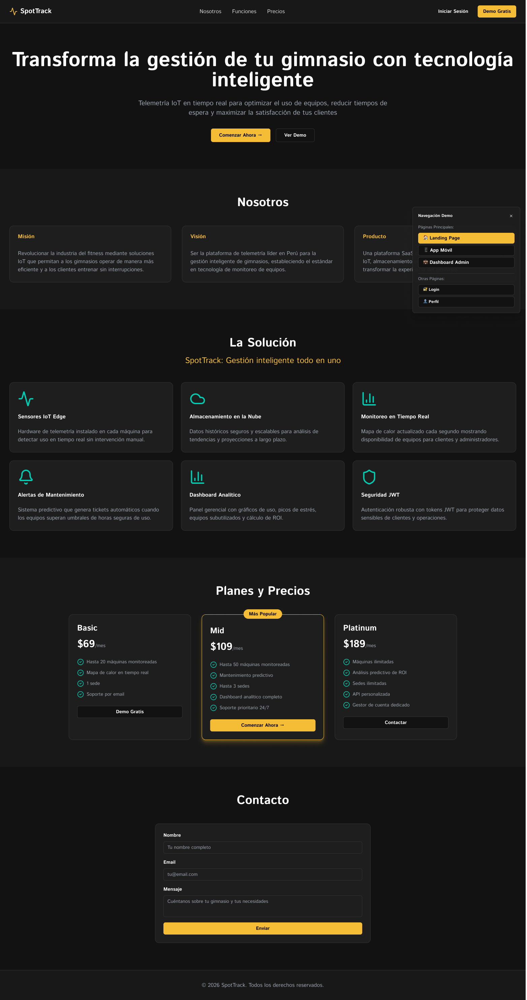

## Web Applications UX/UI Design

### Web Applications Wireframes

### Web Applications Wireflow Diagrams
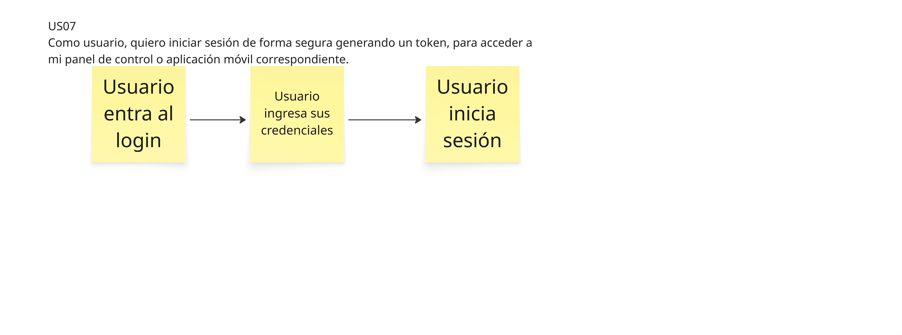
.png)
.png)
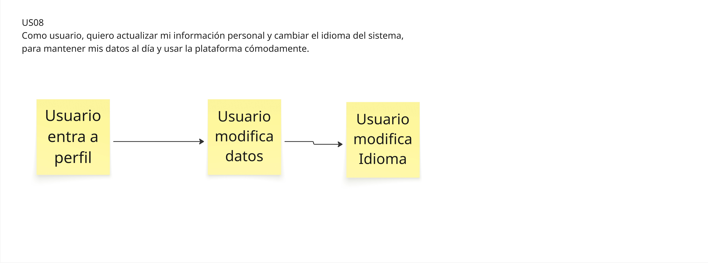
.png)
.png)
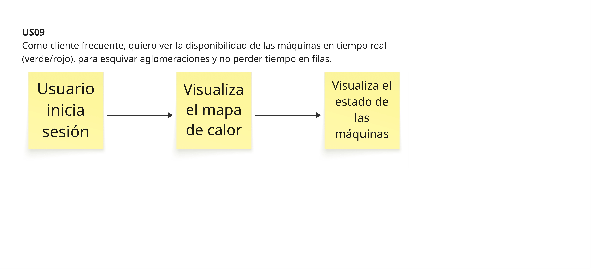

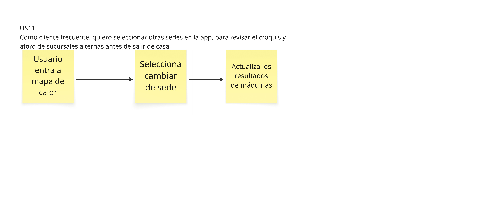
.png)
.png)

.png)
.pngQ)
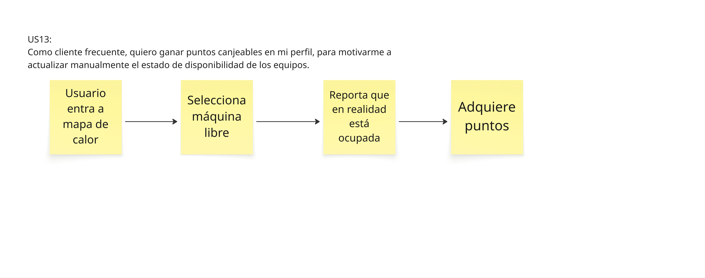

.png)
.png)

### Web Applications Mock-ups
[Mock-ups de alta fidelidad de las pantallas de la aplicación web.]

### Web Applications User Flow Diagrams
    [Diagramas de flujo de usuario que representan los caminos posibles dentro de la aplicación.]

## Web Applications Prototyping
[Descripción y enlace al prototipo interactivo de la aplicación web, con escenarios de prueba definidos.]

## Domain-Driven Software Architecture

### Design-Level Event Storming

### Software Architecture Context Diagram
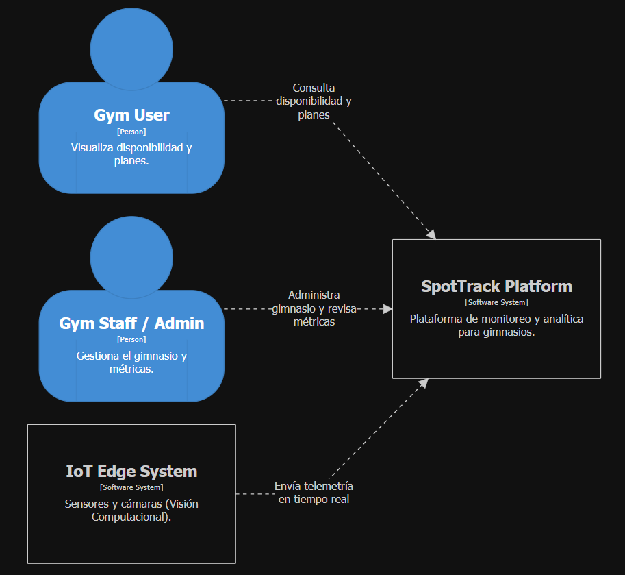

### Software Architecture Container Diagrams
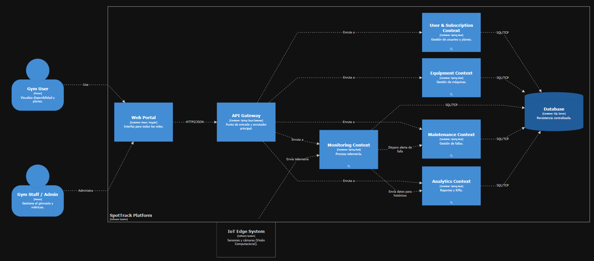

### Software Architecture Components Diagrams

#### Monitoring

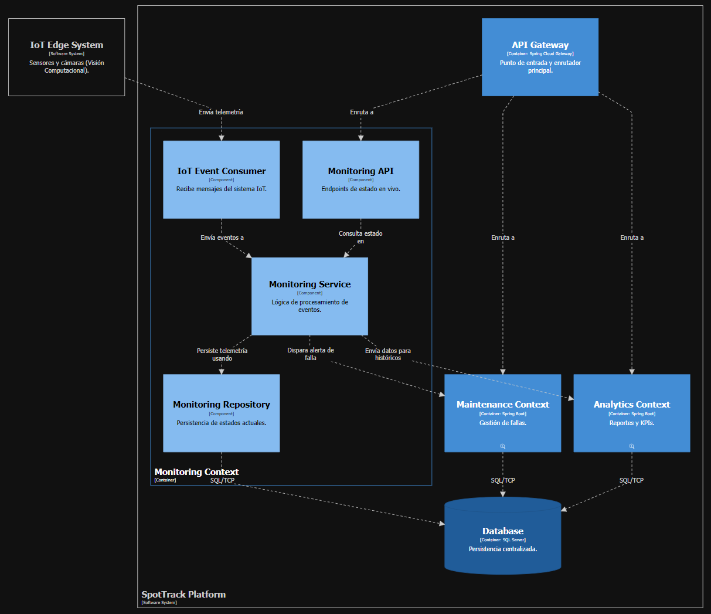

#### User And Subcription

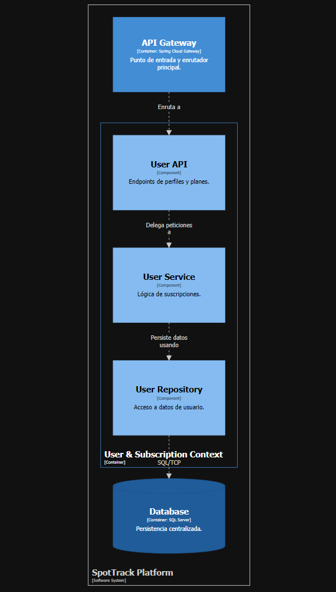

#### Equipment

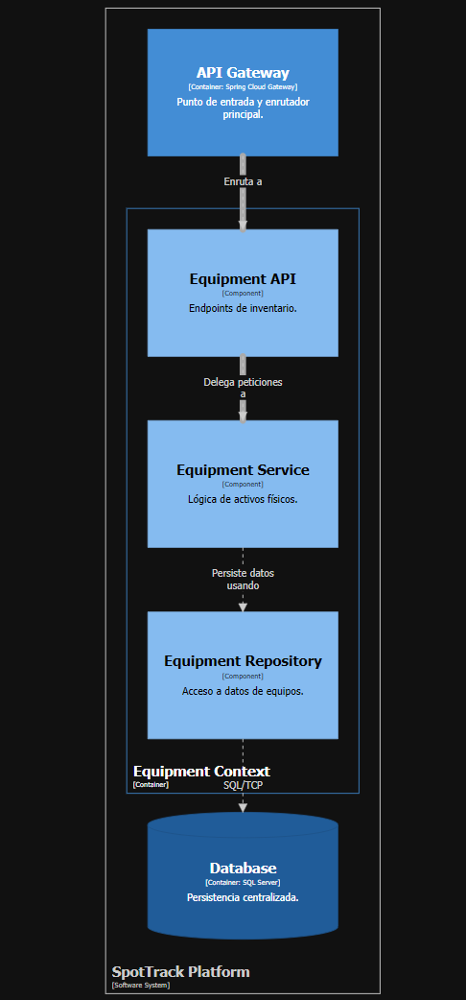

#### Maintenance

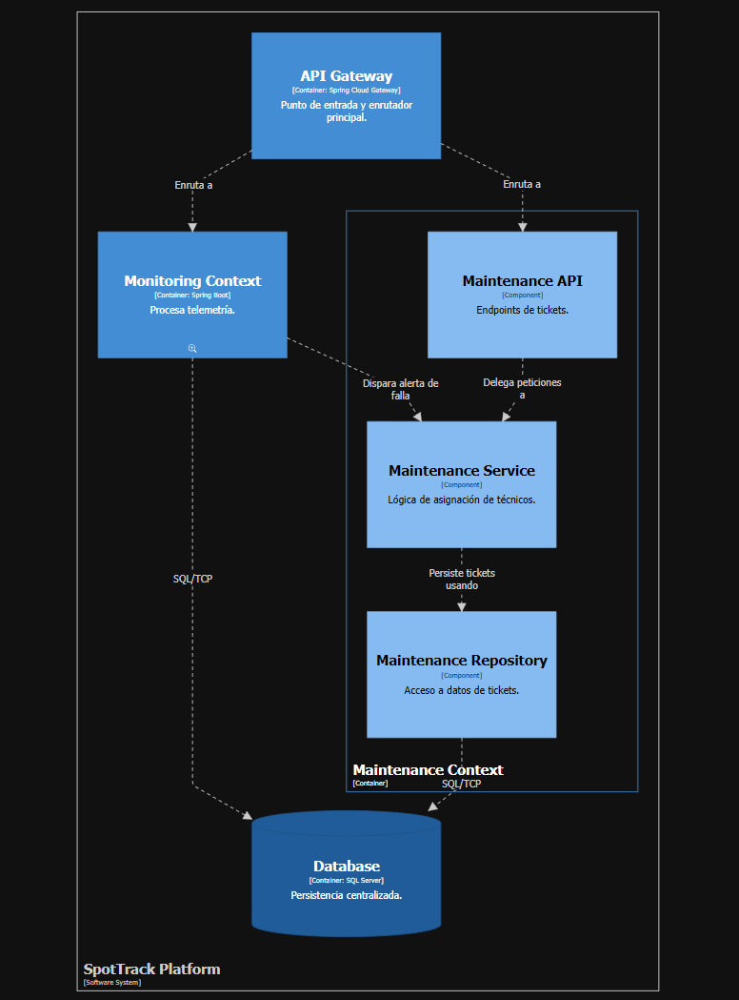

#### Analytics

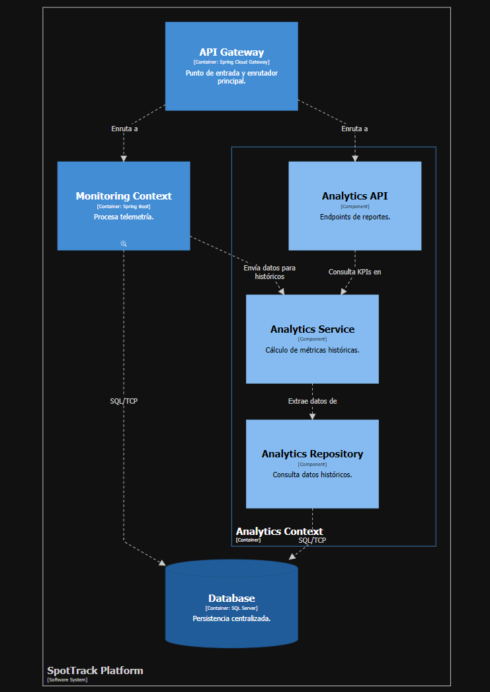

## Software Object-Oriented Design

### Class Diagrams

## Database Design

### Database Diagrams
[Diagramas entidad-relación o de esquema de base de datos, incluyendo tablas, claves y relaciones.]