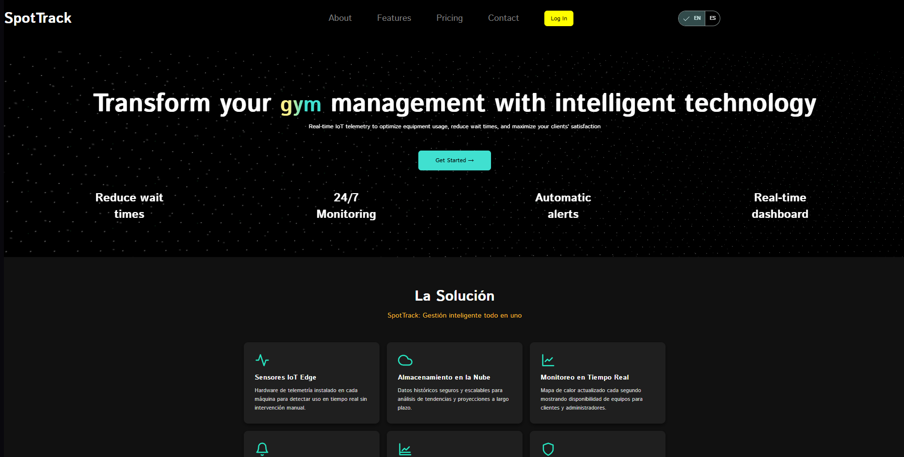
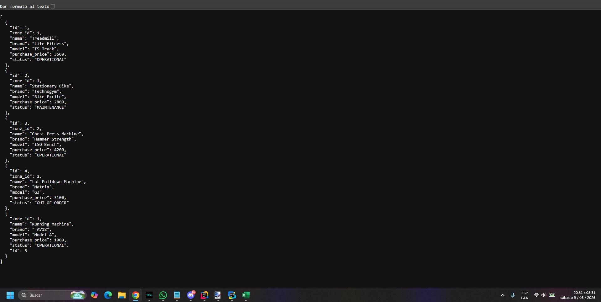

# Capítulo V: Product Implementation, Validation & Deployment

## Software Configuration Management

### Software Development Environment Configuration

**Figma**

{width=150px}

Producto SaaS utilizado para la elaboración de la propuesta de diseño de interfaces (UX/UI), incluyendo la creación de Wireframes, Mock-ups y Prototipos interactivos para el Landing Page y las aplicaciones web. Permite la colaboración en tiempo real del equipo de diseño.

* **Ruta de referencia:** [https://www.figma.com/](https://www.figma.com/)

**HTML5 & CSS3**

{width=150px}

Lenguajes estándar de marcado y hojas de estilo utilizados para definir la estructura semántica y el diseño visual estático de los templates en el Landing Page y los componentes de las Frontend Web Applications.

* **Documentación de referencia:** [https://developer.mozilla.org/](https://developer.mozilla.org/)

**Angular Framework**

{width=150px}

Framework de desarrollo principal para la construcción de las Frontend Web Applications en formato SPA (Single Page Application). Se encarga de la lógica de presentación en el lado del cliente, el enrutamiento y el consumo de la API RESTful utilizando TypeScript como lenguaje de programación.

* **Ruta de descarga:** [https://angular.io/cli](https://angular.io/cli)

**Miro**

{width=150px}

Plataforma de pizarra virtual (SaaS) empleada para las sesiones colaborativas de análisis de dominio y la elaboración de los diagramas de Big Picture EventStorming y Design-Level EventStorming.

* **Ruta de referencia:** [https://miro.com/](https://miro.com/)

**Structurizr**

{width=150px}

Herramienta de modelado utilizada para el diseño y la documentación de la arquitectura de software de la solución, aplicando estrictamente el C4 Model (Context, Container y Component diagrams).

* **Ruta de referencia:** [https://structurizr.com/](https://structurizr.com/)

**Microsoft SQL Server**

{width=150px}

Sistema de Gestión de Bases de Datos Relacionales (RDBMS) utilizado para el diseño y almacenamiento persistente de los datos transaccionales de los Bounded Contexts del sistema. Soporta la integridad referencial y las consultas estructuradas necesarias para la lógica del backend.

* **Ruta de descarga:** [https://www.microsoft.com/sql-server/sql-server-downloads](https://www.microsoft.com/sql-server/sql-server-downloads)

**Spring Boot (Java)**

{width=150px}

Framework backend basado en Java utilizado para la construcción, configuración y despliegue de los RESTful Web Services. Gestiona la lógica de negocio, la seguridad, las transacciones y la exposición de los endpoints que serán consumidos por las aplicaciones web.

* **Ruta de descarga:** [https://spring.io/projects/spring-boot](https://spring.io/projects/spring-boot)

### Source Code Management

El proyecto utiliza **GitHub** como sistema de control de versiones mediante un repositorio público. Se adoptó una estrategia basada en **GitFlow**:
* La rama `main` contiene versiones estables del sistema.
* La rama `develop` funciona como entorno de integración.
* Las nuevas funcionalidades se desarrollan en ramas `feature/*`.

La integración de cambios se realiza mediante **Pull Requests** hacia la rama `develop`, asegurando un control previo antes de incorporar modificaciones. Se emplea una convención de commits semánticos (`feat`, `fix`).

### Source Code Style Guide & Conventions

Para garantizar la claridad y cohesión del código fuente en el desarrollo de la plataforma, el equipo ha adoptado rigurosas convenciones de codificación y una nomenclatura estrictamente en idioma inglés, aplicándose esto a todas las tecnologías de la solución. 

En relación al **frontend**, la estructura semántica y los estilos se rigen por la *Google HTML/CSS Style Guide*, priorizando el uso exclusivo de minúsculas y la separación de palabras mediante guiones (**kebab-case**) para identificadores y clases, tal como se evidencia en selectores estructurales tipo `machine-status-badge` o `asset-detail-card` (Google, s.f.). Asimismo, la lógica de la interfaz y la arquitectura siguen los lineamientos de la *Google TypeScript Style Guide* (Google, s.f.) y la *Angular Coding Style Guide* (Angular, s.f.), aplicando **lowerCamelCase** para la declaración de variables y funciones (por ejemplo, `reportMachineIssue()`) y estandarizando la denominación de archivos por responsabilidades separadas por puntos (ej., `equipment-list.component.ts`). 

Por otro lado, en la **arquitectura del lado del servidor**, el código se alinea con la *Google Java Style Guide* y las directrices de *Spring Boot Features* (Google, s.f.), estableciendo el uso innegociable de **UpperCamelCase (PascalCase)** para la definición de entidades y controladores (ej., `MaintenanceTicketController`), además de seguir patrones arquitectónicos definidos por el framework para la inyección de dependencias. 

Finalmente, para asegurar una trazabilidad transparente entre los requerimientos del gimnasio y las pruebas automatizadas, el equipo utiliza las *Gherkin Conventions for Readable Specifications*, modelando historias de usuario bajo la sintaxis declarativa de comportamiento (**Given, When, Then**), lo que unifica el entendimiento funcional entre desarrolladores y stakeholders (Cucumber, s.f.).

### Software Deployment Configuration

Para el despliegue de la **Landing Page** de SpotTrack, se seleccionó **GitHub Pages** como servicio de hosting estático, aprovechando su integración nativa con el repositorio del equipo. La automatización del proceso se realizó mediante **GitHub Actions**, definiendo un pipeline CI/CD en el archivo `.github/workflows/deploy.yml`. Este workflow se activa automáticamente ante cada `push` a la rama `main`, ejecuta el proceso de build y publica el sitio en la URL pública del repositorio, garantizando que cada cambio integrado quede inmediatamente reflejado en producción sin intervención manual.

La siguiente figura muestra la configuración del archivo de workflow de GitHub Actions utilizado para el despliegue continuo de la Landing Page:

Deployed landing page:

https://spottrack-1asi0729-2610-11881.github.io/SpotTrack-Landing-Page/

## Landing Page, Services & Applications Implementation

### Sprint 1
#### Sprint Planning 1

El presente apartado detalla los acuerdos y objetivos definidos durante el Sprint Planning Meeting de nuestra primera iteración. Para este Sprint inicial de SpotTrack, nuestro esfuerzo se centró en sentar las bases estratégicas y técnicas del proyecto. Esto abarcó desde la elaboración de los artefactos fundacionales de Lean UX y la especificación de requerimientos, hasta el modelado de la arquitectura usando Domain-Driven Design (DDD) y el diseño lógico de la base de datos. Asimismo, priorizamos el prototipado de interfaces en Figma y el despliegue de nuestra Landing Page comercial para asegurar una presencia web temprana orientada a gimnasios y centros deportivos.

| Aspect | Details |
| :--- | :--- |
| **Sprint #** | Sprint 1 |
| **Date** | 2026-04-23 |
| **Time** | 10:00 AM |
| **Location** | Reunión Virtual (Discord / Microsoft Teams) |
| **Prepared By** | Azama Fukuda, Juan Pablo |
| **Attendees (to planning meeting)** | Atoche Gonzales, Nicolas Fernando / Azama Fukuda, Juan Pablo / Cataño Zarate, Jesus Miguel / Espinoza Orrego, Valentino Andre / Fernández Linares, Alvaro Sebastian |
| **Sprint n – 1 Review Summary** | No aplica (Primer Sprint del proyecto). |
| **Sprint n – 1 Retrospective Summary** | No aplica (Primer Sprint del proyecto). |
| **Sprint Goal** | Nuestro enfoque principal es establecer el diseño fundamental de UX/UI, la arquitectura de dominio bajo DDD y el despliegue de la Landing Page de SpotTrack. Consideramos que esto nos entrega una estructura de proyecto clara, los artefactos IoT correctamente modelados y un primer punto de contacto digital para gimnasios y administradores de centros deportivos. Esto se confirmará cuando los artefactos de Lean UX, base de datos, DDD y Figma estén completados, y la Landing Page se encuentre desplegada y funcional en producción. |
| **Sprint n Velocity** | 45 Story Points |
| **Sum of Story Points** | 45 |

#### Aspect Leaders and Collaborators

Durante este sprint, la dinámica de trabajo exigió una división estratégica de los integrantes. Para optimizar el flujo de desarrollo, conformamos subequipos especializados que pudieran concentrarse íntegramente en el ecosistema frontend, la investigación de usuarios y la estructuración de la Landing Page de SpotTrack. Esta organización nos permitió mantener un avance continuo y evitar la fragmentación en microtareas, lo cual habría ocasionado que perdiéramos la perspectiva general de la solución IoT orientada a gimnasios.

| Team Member (Last Name, First Name) | GitHub Username | Aspect Name 1 Leader (L) / Collaborator (C) | Aspect Name 2 Leader (L) / Collaborator (C) | Aspect Name 3 Leader (L) / Collaborator (C) | Aspect Name 4 Leader (L) / Collaborator (C) |
| :--- | :--- | :--- | :--- | :--- | :--- |
| Azama Fukuda, Juan Pablo | llummo | Landing Page Elaboration (L) | Bounded Context Development (C) | Prototyping (L) | Scrum Master Role (L) |
| Atoche Gonzales, Nicolas Fernando | THECOMAX | Landing Page Elaboration (C) | Bounded Context Development (C) | Prototyping (C) | UX Research (L) |
| Cataño Zarate, Jesus Miguel | jcuz1510 | Landing Page Elaboration (C) | Bounded Context Development (L) | Database & Class Diagram (L) | UX Research (C) |
| Espinoza Orrego, Valentino Andre | valentinoespinoza13 | Landing Page Elaboration (C) | Bounded Context Development (C) | Database & Class Diagram (C) | UX Research (C) |
| Fernández Linares, Alvaro Sebastian | ORION-tech-c | Landing Page Elaboration (C) | Bounded Context Development (C) | Prototyping (C) | UX Research (C) |

### Sprint Backlog

| Id | Title | Task Id | Task Title | Description | Estimation (Hours) | Assigned To | Status |
| :--- | :--- | :--- | :--- | :--- | :--- | :--- | :--- |
| | | T01 | UX Research & Entrevistas | Realizar entrevistas a administradores de gimnasios y clientes frecuentes; crear User Personas y Empathy Maps orientados al dominio IoT de SpotTrack. | 6 hrs | Atoche / Espinoza / Azama / Fernández | Done |
| | | T02 | Diseño UX/UI de Landing Page | Diseñar Wireframes, Mockups y User Flows para la presentación comercial web de SpotTrack dirigida a gimnasios B2B. | 5 hrs | Cataño / Azama / Espinoza | Done |
| | | T03 | Domain-Driven Design Artifacts | Elaborar EventStorming, Bounded Contexts y Context Mapping para la lógica de telemetría IoT y gestión de activos. | 5 hrs | Fernández / Atoche | Done |
| | | T04 | Database & Class Diagram | Diseñar el Diagrama de Clases (UML) y el Diagrama Entidad-Relación (ERD) del sistema SpotTrack. | 5 hrs | Fernández / Atoche | To-Do |
| | | T05 | Software Development Environment | Configurar el entorno de desarrollo y dependencias locales para el framework Angular (frontend) y ASP.NET Core (backend). | 2 hrs | Azama | Done |
| | | T06 | Source Code Management & Styles | Definir el Style Guide del código, convenciones de commits y la arquitectura de información base bajo GitFlow. | 2 hrs | Cataño | Done |
| | | T07 | Segmento objetivo & Lean UX Process | Definir segmentos objetivo (administradores de gimnasios y clientes frecuentes), Lean UX Canvas y la matriz de tareas del usuario. | 2 hrs | Cataño | Done |
| | | T08 | Software Deployment Configuration | Configurar el servicio de hosting cloud estático para la Landing Page de SpotTrack (Vercel/Netlify/GitHub Pages). | 3 hrs | Azama | To-Do |
| | | T09 | Sprint 1 Planning & Backlog | Redactar el Sprint Planning, Aspect Leaders y el Backlog en el documento académico del proyecto. | 2 hrs | Espinoza | To-Do |
| | | T10 | Development & Execution Evidence | Recolectar capturas de commits y evidencia gráfica de la ejecución de la Landing Page de SpotTrack. | 2 hrs | Cataño | To-Do |
| | | T11 | Deployment & Services Evidence | Documentar los enlaces de producción desplegados y las métricas de colaboración del equipo en GitHub. | 2 hrs | Fernández | To-Do |
| US-01 | Descripción principal en el Hero Section | T12 | Desarrollo: Hero Section | Maquetar en HTML/CSS/JS la cabecera principal con el mensaje sobre optimización IoT de gimnasios y los CTAs de acceso al portal. | 4 hrs | Azama | Done |
| US-03 | Visualización de Soluciones y Características | T13 | Desarrollo: Módulos del Sistema | Programar la sección responsiva que detalla los seis módulos del sistema: telemetría, mapa de calor, analíticas, mantenimiento predictivo, reservas y reportes. | 4 hrs | Cataño | To-Do |
| US-04 | Selección de planes de suscripción SaaS | T14 | Desarrollo: Pricing Table | Maquetar la tabla de precios interactiva para los planes SaaS (Basic, Mid, Platinum) dirigidos a centros deportivos. | 4 hrs | Espinoza | To-Do |
| US-05 | Envío de formulario de Contacto | T15 | Desarrollo: Formulario & Validaciones | Codificar el formulario de contacto para leads comerciales con validaciones en JavaScript. | 4 hrs | Atoche | To-Do |
| US-06 | Acceso al portal desde la navegación | T16 | Desarrollo: Navbar & Footer | Implementar la barra de navegación superior con botones de Login y Demo visibles, y el footer con enlaces institucionales. | 3 hrs | Fernández | To-Do |

#### Development Evidence for Sprint Review

| Repository | Branch | Commit Id | Commit Message | Commit Message Body | Committed on (Date) |
| :--- | :--- | :--- | :--- | :--- | :--- |
| SpotTrack-1ASI0729-2610-11881/SpotTrack-Landing-Page | feature/hero-section | e480ef9 | feat(hero-section): add background animations | - | 2026-04-19 |
| SpotTrack-1ASI0729-2610-11881/SpotTrack-Landing-Page | feature/header | ed84ec5 | feat: add header | - | 2026-04-19 |
| SpotTrack-1ASI0729-2610-11881/SpotTrack-Landing-Page | develop | 6a2919f | chore: project-setup | - | 2026-04-18 |
| SpotTrack-1ASI0729-2610-11881/SpotTrack-Landing-Page | main | 3871093 | Initial commit | - | 2026-04-18 |

#### Execution Evidence for Sprint Review

A lo largo de esta primera iteración del proyecto SpotTrack, logramos consolidar el diseño estratégico del sistema apoyándonos en la elaboración de artefactos de Domain-Driven Design orientados al dominio de telemetría IoT para gimnasios, así como en el modelado estructural de la base de datos. Esta arquitectura, diseñada para integrarse con sensores Edge que capturan el estado de ocupación de las máquinas en tiempo real, se complementó con una exhaustiva investigación de Experiencia de Usuario (UX/UI) enfocada en los dolores reales de administradores de centros deportivos y clientes frecuentes de gimnasio.

#### Team Collaboration Insights during Sprint

### Sprint 2

#### Sprint Planning 2

El presente apartado detalla los acuerdos y objetivos definidos durante el Sprint Planning Meeting de nuestra segunda iteración. Para este Sprint, el equipo se enfocó en dos frentes de trabajo simultáneos: (1) la corrección y completitud de todos los artefactos pendientes del Sprint 1, incluyendo el despliegue completo de la Landing Page; y (2) el inicio del desarrollo frontend de la Web Application principal (Angular), empleando una Fake API (JSON Server) como capa de datos simulada para desacoplar el desarrollo frontend del backend real, cuya implementación se reserva para el Sprint 3.

| Aspect | Details |
| :--- | :--- |
| **Sprint #** | Sprint 2 |
| **Date** | 2026-05-08 |
| **Time** | 10:00 AM |
| **Location** | Reunión Virtual (Discord / Microsoft Teams) |
| **Prepared By** | Azama Fukuda, Juan Pablo |
| **Attendees (to planning meeting)** | Atoche Gonzales, Nicolas Fernando / Azama Fukuda, Juan Pablo / Cataño Zarate, Jesus Miguel / Espinoza Orrego, Valentino Andre / Fernández Linares, Alvaro Sebastian |
| **Sprint n – 1 Review Summary** | Sprint 1 entregó los artefactos fundacionales de Lean UX, DDD, diseño UX/UI en Figma y el inicio de la Landing Page (Hero Section y Header). Sin embargo, quedaron pendientes el despliegue, las secciones de módulos, precios y contacto de la Landing Page, así como diversas secciones de documentación del informe. |
| **Sprint n – 1 Retrospective Summary** | El equipo identificó que la carga de trabajo de documentación y diseño subestimó el tiempo necesario. Para este Sprint 2 se priorizará paralelizar la corrección de Sprint 1 con el inicio del desarrollo de la Web App, asignando responsables claros por cada frente. |
| **Sprint Goal** | Nuestro enfoque es completar todos los artefactos pendientes del Sprint 1 (correcciones de documentación y Landing Page completa) e iniciar el desarrollo frontend de la Web Application de SpotTrack consumiendo una Fake API, implementando las vistas de autenticación, mapa de calor, gestión de activos, alertas de mantenimiento y sugerencias de rutinas. Esto se confirmará cuando la Landing Page esté desplegada y funcional con todas sus secciones, y las vistas frontend de las User Stories priorizadas estén implementadas y navegables en el entorno de desarrollo local. |
| **Sprint n Velocity** | 58 Story Points |
| **Sum of Story Points** | 58 |

#### Aspect Leaders and Collaborators

Para este Sprint 2, el equipo adoptó una estructura dual de trabajo: un subequipo dedicado a las correcciones del Sprint 1 (documentación + Landing Page) y otro enfocado en el desarrollo frontend de la Web Application. Esta división permite avanzar en paralelo sin bloqueos entre tareas de distinta naturaleza.

| Team Member (Last Name, First Name) | GitHub Username | Aspect 1: Sprint 1 Corrections Leader (L) / Collaborator (C) | Aspect 2: Angular App Setup & Auth Leader (L) / Collaborator (C) | Aspect 3: Client App Frontend (Heatmap & Routines) Leader (L) / Collaborator (C) | Aspect 4: Admin Dashboard Frontend Leader (L) / Collaborator (C) |
| :--- | :--- | :--- | :--- | :--- | :--- |
| Azama Fukuda, Juan Pablo | llummo | Corrections (C) | Angular App Setup (L) | Client App (C) | Admin Dashboard (C) |
| Atoche Gonzales, Nicolas Fernando | THECOMAX | Corrections (C) | Fake API Config (L) | Client App (C) | Admin Dashboard (C) |
| Cataño Zarate, Jesus Miguel | jcuz1510 | Landing Page Completion (L) | Angular App Setup (C) | Client App (C) | Admin Dashboard (C) |
| Espinoza Orrego, Valentino Andre | valentinoespinoza13 | Corrections (C) | Angular App Setup (C) | Client App (C) | Admin Dashboard (L) |
| Fernández Linares, Alvaro Sebastian | ORION-tech-c | Corrections (L) | Angular App Setup (C) | Client App (L) | Admin Dashboard (C) |

#### Sprint Backlog

> **Nota:** Las tareas de corrección (prefijo `CORR-`) y las de infraestructura (prefijo `SETUP-`) son **storyless** — no corresponden a ninguna User Story y no tienen Story Points asignados, pero son obligatorias para subsanar deficiencias del Sprint anterior y preparar el entorno de desarrollo.

---

**Tareas de Corrección Sprint 1 (Storyless)**

| Id | Title | Task Id | Task Title | Description | Estimation (Hours) | Assigned To | Status |
| :--- | :--- | :--- | :--- | :--- | :--- | :--- | :--- |
| - | Corrección Sprint 1 | CORR-01 | Completar sección "The Solution" en Landing Page | Maquetar las seis tarjetas de soluciones del sistema (US-03 pendiente) con HTML/CSS responsivo. | 3 hrs | Cataño | To-Do |
| - | Corrección Sprint 1 | CORR-02 | Completar Pricing Table en Landing Page | Implementar la tabla comparativa de planes SaaS Basic/Mid/Platinum con CTAs (US-04 pendiente). | 3 hrs | Cataño | To-Do |
| - | Corrección Sprint 1 | CORR-03 | Completar formulario de Contacto en Landing Page | Codificar el formulario de contacto con validaciones JavaScript (US-05 pendiente). | 3 hrs | Espinoza | To-Do |
| - | Corrección Sprint 1 | CORR-04 | Completar Navbar y Footer de Landing Page | Implementar la barra de navegación sticky con anchor links y el footer con enlaces institucionales (US-06 pendiente). | 3 hrs | Fernández | To-Do |
| - | Corrección Sprint 1 | CORR-05 | Despliegue de Landing Page en producción | Configurar y publicar la Landing Page en Vercel o GitHub Pages (T08 pendiente). Documentar el enlace de producción. | 2 hrs | Azama | To-Do |
| - | Corrección Sprint 1 | CORR-06 | Completar Diagrama de Base de Datos ERD y Diagrama de Clases | Finalizar y subir el ERD y el Diagrama de Clases UML al repositorio (T04 pendiente). Actualizar referencias en el informe. | 4 hrs | Atoche / Cataño | To-Do |
| - | Corrección Sprint 1 | CORR-07 | Completar evidencias del Sprint 1 en el informe | Añadir capturas de pantalla de la Landing Page, commits reales y métricas de GitHub Insights en las secciones Development Evidence, Execution Evidence y Team Collaboration Insights. | 2 hrs | Espinoza / Fernández | To-Do |
| - | Corrección Sprint 1 | CORR-08 | Completar Big Picture Event Storming (Capítulo II) | Elaborar y añadir el Big Picture Event Storming al Capítulo II (sección actualmente vacía). | 3 hrs | Atoche | To-Do |
| - | Corrección Sprint 1 | CORR-09 | Completar sección Software Deployment Configuration (Capítulo V) | Redactar la descripción del entorno de despliegue, pipelines CI/CD y hosting utilizados. | 1 hr | Azama | To-Do |
| - | Corrección Sprint 1 | CORR-10 | Completar Project Report Collaboration Insights (Capítulo 0) | Añadir la descripción de la colaboración del equipo en el desarrollo del informe con evidencia de GitHub. | 1 hr | Espinoza | To-Do |
| - | Corrección Sprint 1 | CORR-11 | Agregar Student Outcome de Cataño Zárate (Capítulo 0) | Añadir las entradas de "Comunica oralmente" y "Comunica por escrito" para Jesús Miguel Cataño Zárate, actualmente ausentes de la tabla. | 1 hr | Cataño | To-Do |
| - | Corrección Sprint 1 | CORR-12 | Estandarizar análisis de entrevistas 4 y 5 | Añadir el campo "Resumen" completo a las entrevistas de Joan Steffano Quispe (Entrevistado 4) y Fabián Suárez (Entrevistado 5), siguiendo el mismo formato de las entrevistas 1–3. | 2 hrs | Fernández | To-Do |
| - | Corrección Sprint 1 | CORR-13 | Subir fotos faltantes de integrantes del equipo | Agregar al repositorio las imágenes `foto-valentino.jpeg`, `foto-nicolas.png` y `foto-jesus-c.png`, referenciadas en el Capítulo I pero ausentes en la carpeta assets. | 1 hr | Azama / Cataño | To-Do |
| - | Corrección Sprint 1 | CORR-14 | Corregir inconsistencia de tech stack (ASP.NET vs Spring Boot) | En el Sprint 1 Backlog, la tarea T05 menciona "ASP.NET Core" como backend, pero el tech stack oficial declara Spring Boot. Corregir la descripción de T05 en el informe. | 0.5 hrs | Azama | To-Do |
| - | Corrección Sprint 1 | CORR-15 | Corregir nombre de marca en análisis competitivo | La tabla de análisis competitivo usa "SpotTrack" (nombre antiguo) en lugar de "SpotTrack". Actualizar todas las instancias en el Capítulo II. | 0.5 hrs | Espinoza | To-Do |

---

**Tareas de Infraestructura y Setup (Storyless)**

| Id | Title | Task Id | Task Title | Description | Estimation (Hours) | Assigned To | Status |
| :--- | :--- | :--- | :--- | :--- | :--- | :--- | :--- |
| - | Setup Web App | SETUP-01 | Crear proyecto Angular con estructura por Bounded Contexts | Inicializar el proyecto Angular (ng new spottrack-app), configurar la estructura de carpetas por bounded context: `auth/`, `heatmap/`, `admin/`, `maintenance/`, `equipment/`, `routines/`, `shared/`, `analytics/`. | 3 hrs | Azama | Done |
| - | Setup Web App | SETUP-02 | Configurar JSON Server como Fake API | Instalar y configurar `json-server` con un `db.json` que contenga datos seed para: `users`, `equipments`, `IoT`, `alerts`, `tickets`, `reservations`, `routines/alternatives`, `analytics`. Exponer en `localhost:3000`. | 3 hrs | Atoche | To-Do |
| - | Setup Web App | SETUP-03 | Documentar Sprint 2 Planning, Backlog y evidencias en el informe | Redactar las secciones de Sprint Planning 2, Aspect Leaders y Sprint Backlog en el Capítulo V. Al finalizar el sprint, completar Development Evidence, Execution Evidence y Team Collaboration Insights. | 3 hrs | Espinoza | To-Do |

---

**User Stories — Desarrollo Frontend con Fake API**

| US Id | US Title | Task Id | Task Title | Description | Estimation (Hours) | Assigned To | Status |
| :--- | :--- | :--- | :--- | :--- | :--- | :--- | :--- |
| US26 | Gestión de activos físicos y altas | T01 | Implement equipment registration form | Build the UI form to register new equipment linked to an IoT sensor | 6 | Juan Pablo | Done |
| US26 | Gestión de activos físicos y altas | T02 | Implement equipment decommission flow | Add decommission action and confirmation dialog | 4 | Juan Pablo | To-do |
| US21 | Monitoreo de estado de hardware Edge IoT | T03 | Build IoT node health dashboard view | Display connected/disconnected status per sensor node | 5 | Juan Pablo | To-do |
| US21 | Monitoreo de estado de hardware Edge IoT | T04 | Implement reconnection status sync | Handle state sync when a node reconnects | 4 | Juan Pablo | To-do |
| TS12 | Registrar evento de telemetría IoT API | T05 | Implement POST /api/v1/telemetry endpoint | Receive and process IoT sensor state events | 5 | Juan Pablo | To-do |
| TS12 | Registrar evento de telemetría IoT API | T06 | Validate telemetry payload and auth | Return 400 on malformed or unauthorized payloads | 3 | Juan Pablo | To-do |
| TS13 | Listar historial de uso general API | T07 | Implement GET /api/v1/telemetry endpoint | Return usage history array filtered by date range | 4 | Juan Pablo | To-do |
| US08 | Gestión de preferencias y perfil | T08 | Build profile edit view | Allow user to update personal data and language preference | 4 | Jesús | To-do |
| US08 | Gestión de preferencias y perfil | T09 | Implement language toggle i18n | Wire language selector to i18n service | 3 | Jesús | To-do |
| US12 | Notificaciones push de disponibilidad | T10 | Build availability bell subscription UI | Allow client to subscribe to machine availability alert | 4 | Jesús | To-do |
| US12 | Notificaciones push de disponibilidad | T11 | Display push notification on machine release | Show notification when subscribed machine becomes free | 3 | Jesús | To-do |
| US13 | Sistema de recompensas Crowdsourcing | T12 | Build manual status report UI | Allow client to report machine status manually | 5 | Jesús | To-do |
| US13 | Sistema de recompensas Crowdsourcing | T13 | Display reward points in profile | Show accumulated points after validated report | 3 | Jesús | To-do |
| US24 | Notificación de restablecimiento a usuarios | T14 | Show restoration notification to clients | Notify clients when a repaired machine is back online | 3 | Nicolas | To-do |
| US09 | Visualización del mapa de calor en vivo | T15 | Build interactive heatmap component | Render machine availability map with green/red indicators | 8 | Juan Pablo | To-do |
| US09 | Visualización del mapa de calor en vivo | T16 | Implement real-time status update via polling | Auto-update machine icons without page reload | 6 | Juan Pablo | To-do |
| US10 | Filtrado del inventario por tipo de máquina | T17 | Implement filter tags component | Add Fuerza/Cardio filter tags to heatmap | 4 | Juan Pablo | To-do |
| US10 | Filtrado del inventario por tipo de máquina | T18 | Implement clear filters action | Restore full inventory on filter clear | 2 | Juan Pablo | To-do |
| US11 | Cambio de sucursal para revisión de aforo | T19 | Implement branch selector component | Allow user to switch branches and reload heatmap | 4 | Juan Pablo | To-do |
| US11 | Cambio de sucursal para revisión de aforo | T20 | Block premium branch for basic plan users | Show upgrade suggestion when branch access is denied | 3 | Juan Pablo | To-do |
| US14 | Motor de sugerencia de rutinas alternativas | T21 | Build alternative routine suggestion view | Show alternative exercises when selected machine is occupied | 6 | Álvaro | To-do |
| US14 | Motor de sugerencia de rutinas alternativas | T22 | Handle no-alternatives scenario | Suggest bodyweight exercises when gym is at full capacity | 3 | Álvaro | To-do |
| US15 | Filtrado de alternativas por grupo muscular | T23 | Filter suggestions by target muscle group | Discard exercises from other muscle groups in suggestions | 4 | Álvaro | To-do |
| US15 | Filtrado de alternativas por grupo muscular | T24 | Exclude machines with open tickets from suggestions | Filter out equipment in maintenance from suggestions | 3 | Álvaro | To-do |
| US16 | Sistema de reserva exprés en horas pico | T25 | Build express reservation button and timer UI | Show yellow status and countdown on reservation | 5 | Álvaro | To-do |
| US16 | Sistema de reserva exprés en horas pico | T26 | Implement reservation expiry release flow | Return machine to free state when timer runs out | 4 | Álvaro | To-do |
| US25 | Calendario inteligente de bloqueos | T27 | Build smart schedule view with peak-hour warnings | Show warning when client selects high-demand slot | 5 | Álvaro | To-do |
| US25 | Calendario inteligente de bloqueos | T28 | Implement valley-hour suggestion on conflict | Suggest off-peak alternative when peak slot is selected | 4 | Álvaro | To-do |
| TS18 | Crear reserva exprés API | T29 | Implement POST /api/v1/reservations endpoint | Execute logical machine block during high demand | 5 | Nicolas | To-do |
| TS19 | Cancelar reserva exprés API | T30 | Implement PUT /api/v1/reservations/{id}/cancel endpoint | Release machine block on timer expiry or user abort | 3 | Nicolas | To-do |
| TS20 | Obtener sugerencias de rutinas API | T31 | Implement GET /api/v1/routines/alternatives endpoint | Run replacement algorithm by muscle group and availability | 5 | Nicolas | To-do |
| TS20 | Obtener sugerencias de rutinas API | T32 | Handle bodyweight fallback in suggestions | Return bodyweight alternatives when no machines are free | 3 | Nicolas | To-do |
| TS14 | Obtener picos de afluencia por día API | T33 | Implement GET /api/v1/analytics/peak-hours endpoint | Identify hourly blocks exceeding 90% capacity | 5 | Nicolas | To-do |
| TS15 | Exportar reporte gerencial API | T34 | Implement GET /api/v1/analytics/export/pdf endpoint | Generate binary PDF stream of monthly usage report | 5 | Nicolas | To-do |
| TS16 | Registrar estado manual de máquina API | T35 | Implement POST /api/v1/machines/{id}/manual-reports endpoint | Save crowdsourcing report to validation queue | 3 | Nicolas | To-do |
| TS17 | Sumar puntos de recompensa API | T36 | Implement PUT /api/v1/users/{id}/points endpoint | Increment points when manual report matches IoT reading | 3 | Nicolas | To-do |
| TS21 | Crear ticket de mantenimiento API | T37 | Implement POST /api/v1/tickets endpoint | Register incident and set machine to In Maintenance | 3 | Nicolas | To-do |
| TS22 | Listar tickets activos/históricos API | T38 | Implement GET /api/v1/tickets endpoint | Return filtered ticket backlog by branch or status | 3 | Nicolas | To-do |
| TS23 | Resolver ticket técnico API | T39 | Implement PUT /api/v1/tickets/{id}/resolve endpoint | Close ticket and return machine to free status | 3 | Nicolas | To-do |
| TS24 | Generar alerta predictiva API | T40 | Implement POST /api/v1/alerts endpoint | Auto-generate alert when usage exceeds safe threshold | 5 | Nicolas | To-do |
| TS25 | Programar bloqueo de mantenimiento API | T41 | Implement POST /api/v1/maintenance-blocks endpoint | Validate maintenance schedule against peak-hour conflicts | 5 | Nicolas | To-do |
| TS26 | Calcular impacto financiero API | T42 | Implement GET /api/v1/analytics/financial-impact endpoint | Convert downtime hours to monetary loss estimate | 5 | Nicolas | To-do |
| TS27 | Simular ROI API | T43 | Implement POST /api/v1/analytics/roi-projection endpoint | Run ROI simulation based on stress telemetry | 5 | Nicolas | To-do |
| TS05 | Crear nueva máquina API | T44 | Implement POST /api/v1/machines endpoint | Register new equipment linked to IoT sensor | 3 | Nicolas | To-do |
| TS06 | Listar máquinas por sede API | T45 | Implement GET /api/v1/machines endpoint | Return full inventory filtered by branchId | 3 | Nicolas | To-do |
| TS07 | Mostrar máquina por Id API | T46 | Implement GET /api/v1/machines/{id} endpoint | Return detailed physical and logical machine data | 2 | Nicolas | To-do |
| TS08 | Actualizar/Reubicar máquina API | T47 | Implement PUT /api/v1/machines/{id} endpoint | Allow branch reassignment or attribute update | 3 | Nicolas | To-do |
| TS09 | Dar de baja máquina API | T48 | Implement DELETE /api/v1/machines/{id} endpoint | Apply soft-delete and unlink IoT sensor | 2 | Nicolas | To-do |
| TS10 | Registrar repuesto en inventario API | T49 | Implement POST /api/v1/inventory endpoint | Add new spare part to maintenance stock | 3 | Nicolas | To-do |
| TS11 | Actualizar stock de repuesto API | T50 | Implement PUT /api/v1/inventory/{id}/stock endpoint | Discount materials when a ticket is resolved | 3 | Nicolas | To-do |
| US17 | Acumulación automática de horas de uso | T51 | Build equipment usage hours chart | Display cumulative usage minutes per machine | 5 | Valentino | To-do |
| US17 | Acumulación automática de horas de uso | T52 | Implement date range filter on usage chart | Recalculate totals based on selected period | 4 | Valentino | To-do |
| US18 | Identificación de equipos subutilizados | T53 | Build underutilized equipment table | Highlight machines below usage threshold | 4 | Valentino | To-do |
| US18 | Identificación de equipos subutilizados | T54 | Implement CSV export for underutilized list | Download underutilized equipment data as CSV | 3 | Valentino | To-do |
| US19 | Visualización de picos de estrés del local | T55 | Build peak stress hours chart | Mark red hourly blocks exceeding 90% capacity | 5 | Valentino | To-do |
| US19 | Visualización de picos de estrés del local | T56 | Implement intersemanal comparison overlay | Superimpose two trend lines for weekly comparison | 4 | Valentino | To-do |
| US20 | Exportación de analíticas de uso | T57 | Build PDF export button on dashboard | Trigger formatted PDF download from analytics view | 4 | Valentino | To-do |
| US20 | Exportación de analíticas de uso | T58 | Handle export delay with email fallback notice | Show deferred notice when server is under load | 2 | Valentino | To-do |
| US22 | Alerta predictiva de mantenimiento | T59 | Build maintenance alert banner component | Display predictive alert when threshold is exceeded | 5 | Nicolas | To-do |
| US22 | Alerta predictiva de mantenimiento | T60 | Implement manual threshold configuration UI | Allow manager to set safe hours limit per machine | 4 | Nicolas | To-do |
| US23 | Despacho automatizado de tickets técnicos | T61 | Build assign-to-support action on alert | Convert alert to ticket and notify technician | 4 | Nicolas | To-do |
| US23 | Despacho automatizado de tickets técnicos | T62 | Update machine status to In Maintenance on ticket creation | Reflect maintenance state on public heatmap | 3 | Nicolas | To-do |
| US27 | Estadísticas de reubicación multisede | T63 | Build cross-branch utilization stats view | Show demand comparison between branches | 6 | Valentino | To-do |
| US27 | Estadísticas de reubicación multisede | T64 | Display relocation recommendation card | Show transfer suggestion when demand imbalance is detected | 4 | Valentino | To-do |
| US28 | Gestión automatizada de stock de repuestos | T65 | Build spare parts inventory table | Show current stock per part with restock alert indicator | 4 | Nicolas | To-do |
| US28 | Gestión automatizada de stock de repuestos | T66 | Implement restock alert notification display | Show alert when part reaches minimum stock level | 3 | Nicolas | To-do |
| US29 | Calculadora de impacto financiero | T67 | Build financial impact module view | Display estimated monetary loss per machine downtime | 5 | Valentino | To-do |
| US29 | Calculadora de impacto financiero | T68 | Show monthly inefficiency cost chart | Render total hidden cost from equipment inactivity | 4 | Valentino | To-do |
| US30 | Analítica predictiva de compras e inversión | T69 | Build ROI projection simulation view | Allow manager to input acquisition cost and see ROI estimate | 5 | Valentino | To-do |
| US30 | Analítica predictiva de compras e inversión | T70 | Display purchase recommendation on saturation | Show buy suggestion when machine consistently exceeds max capacity | 4 | Valentino | To-do |

Trello board: https://trello.com/invite/b/69fc21c2d05be44be499c75d/ATTI944e7a75fa88bba093494745abbec4eb6F6DB156/spottrack-tb1

#### Development Evidence for Sprint Review

| Repository | Branch | Commit Id | Commit Message | Commit Message Body | Committed on (Date) |
| :--- | :--- | :--- | :--- | :--- | :--- |
| SpotTrack-1ASI0729-2610-11881/SpotTrack-Landing-Page | feature/solution-section | - | feat(solution): add solution modules section | - | - |
| SpotTrack-1ASI0729-2610-11881/SpotTrack-Landing-Page | feature/pricing-section | - | feat(pricing): add pricing table SaaS plans | - | - |
| SpotTrack-1ASI0729-2610-11881/SpotTrack-Landing-Page | feature/contact-form | - | feat(contact): add contact form with validations | - | - |
| SpotTrack-1ASI0729-2610-11881/SpotTrack-Landing-Page | feature/navbar-footer | - | feat(nav): add sticky navbar and footer | - | - |
| SpotTrack-1ASI0729-2610-11881/SpotTrack-Web-App | feature/app-setup | - | chore: initialize angular project structure | - | - |
| SpotTrack-1ASI0729-2610-11881/SpotTrack-Web-App | feature/fake-api | - | chore(api): add json-server fake api with seed data | - | - |
| SpotTrack-1ASI0729-2610-11881/SpotTrack-Web-App | feature/auth | - | feat(auth): implement login component and auth service | - | - |
| SpotTrack-1ASI0729-2610-11881/SpotTrack-Web-App | feature/heatmap | - | feat(heatmap): implement heat map component with machine status | - | - |
| SpotTrack-1ASI0729-2610-11881/SpotTrack-Web-App | feature/admin-dashboard | - | feat(admin): implement alerts panel and asset management | - | - |

#### Execution Evidence for Sprint Review

[Añadir capturas de pantalla de la Landing Page desplegada con todas sus secciones, y del Web App Angular mostrando: vista de Login, Mapa de Calor con indicadores semaforizados, panel de Alertas de Mantenimiento y tabla de Gestión de Activos.]

#### Services Documentation Evidence for Sprint Review

Para este Sprint, se ha implementado y desplegado con éxito un Mock API utilizando JSON-Server, alojado en Azure App Service. Este servicio proporciona un backend funcional para el proyecto SpotTrack, permitiendo la persistencia de datos y la integración con el frontend. Se configuró un flujo de CI/CD mediante GitHub Actions, integrando el perfil de publicación de Azure como un secreto de organización. La API está configurada con un prefijo /api/v1 y soporta operaciones CRUD completas, facilitando el desarrollo paralelo de las funcionalidades de monitoreo de equipos y gestión de dispositivos IoT.

##### Relación de Endpoints Documentados

| Endpoint | Acción | Verbo HTTP | Sintaxis de Llamada      | Ejemplo de Response | Explicación |
|---|---|---|--------------------------|---|---|
| `/gyms` | Listar / Crear | `GET`, `POST` | `/api/v1/gyms`           | `{ "id": 1, "name": "FitNode Central", "subscription_tier": "Premium", "created_at": "2026-05-01T10:00:00Z" }` | Gestión de la entidad principal del gimnasio. |
| `/branches` | Listar / Crear | `GET`, `POST` | `/api/v1/branches`              | `{ "id": 1, "gym_id": 1, "name": "Main Branch", "address": "123 Main Street", "city": "Lima" }` | Información de sedes físicas. |
| `/zones` | Listar / Crear | `GET`, `POST` | `/api/v1/zones`                 | `{ "id": 1, "branch_id": 1, "name": "Cardio Zone", "capacity_limit": 20 }` | Áreas específicas dentro de una sede (ej. Cardio). |
| `/users` | Listar / Crear | `GET`, `POST` | `/api/v1/users`                 | `{ "id": 1, "gym_id": 1, "name": "Admin User", "email": "admin@fitnode.com", "role": "ADMIN" }` | Gestión de acceso y perfiles de usuario. |
| `/equipments` | Listar / Crear | `GET`, `POST` | `/api/v1/equipments`            | `{ "id": 1, "zone_id": 1, "name": "Treadmill", "brand": "Life Fitness", "model": "T5 Track", "status": "OPERATIONAL" }` | Inventario de máquinas de entrenamiento. |
| `/iot_devices` | Listar / Crear | `GET`, `POST` | `/api/v1/iot_devices`           | `{ "id": 1, "equipment_id": 1, "mac_address": "AA:BB:CC:DD:01", "status": "ACTIVE" }` | Dispositivos de monitoreo vinculados a equipos. |
| `/sensor_data` | Listar / Crear | `GET`, `POST` | `/api/v1/sensor_data`           | `{ "id": 1, "device_id": 1, "timestamp": "2026-05-04T09:00:00Z", "occupancy_detected": true, "vibration_index": 0.75 }` | Captura de telemetría y detección de ocupación. |
| `/usage_sessions` | Listar / Crear | `GET`, `POST` | `/api/v1/usage_sessions`        | `{ "id": 1, "equipment_id": 1, "start_time": "2026-05-04T08:00:00Z", "end_time": "2026-05-04T08:30:00Z", "calories_burned_est": 250.5 }` | Historial de uso de máquinas por sesión. |
| `/equipment_usage_stats` | Listar / Crear | `GET`, `POST` | `/api/v1/equipment_usage_stats` | `{ "id": 1, "equipment_id": 1, "total_usage_hours": 120.5, "usage_count_daily": 8, "estimated_wear_level": 0.35 }` | Estadísticas acumuladas y nivel de desgaste. |
| `/maintenance_tickets` | Listar / Crear | `GET`, `POST` | `/api/v1/maintenance_tickets`   | `{ "id": 1, "equipment_id": 2, "status": "OPEN", "priority": "HIGH", "type": "CORRECTIVE" }` | Registro de fallos y tickets de reparación. |
| `/maintenance_logs` | Listar / Crear | `GET`, `POST` | `/api/v1/maintenance_logs`      | `{ "id": 1, "ticket_id": 1, "action_description": "Replaced internal belt", "cost": 150.0 }` | Bitácora de acciones realizadas en mantenimientos. |
| `/maintenance_schedules` | Listar / Crear | `GET`, `POST` | `/api/v1/maintenance_schedules` | `{ "id": 1, "equipment_id": 1, "scheduled_date": "2026-06-01", "task_type": "LUBRICATION" }` | Planificación de mantenimientos preventivos. |
| `/spare_parts` | Listar / Crear | `GET`, `POST` | `/api/v1/spare_parts`           | `{ "id": 1, "gym_id": 1, "part_name": "Treadmill Belt", "stock_quantity": 5, "unit_cost": 80.0 }` | Inventario de repuestos para equipos. |
| `/alerts` | Listar / Crear | `GET`, `POST` | `/alerts`                | `{ "id": 1, "equipment_id": 4, "severity": "CRITICAL", "message": "Equipment out of order", "is_resolved": false }` | Notificaciones de estado crítico de equipos. |
| `/notifications` | Listar / Crear | `GET`, `POST` | `/api/v1/notifications`         | `{ "id": 1, "user_id": 1, "title": "Critical Alert", "content": "Lat Pulldown Machine is out of order", "is_read": false }` | Mensajes enviados a usuarios finales. |

##### Evidencias de Interacción con la Documentación

###### Disponibilidad del Servicio
Validación del endpoint /api/v1/health que confirma el estado "ok" del servidor en Azure.

###### Interacción con Recurso Equipments
Visualización de los datos de equipos obtenidos directamente desde el App Service de Azure.

##### Repositorio y Trazabilidad de Documentación

Para asegurar la transparencia y el seguimiento de los cambios, se detallan los enlaces a los repositorios de la organización.

URL Repositorio Mock API: https://github.com/SpotTrack-1ASI0729-2610-11881/SpotTrack-Mock-Api

URL Repositorio Frontend: https://github.com/SpotTrack-1ASI0729-2610-11881/SpotTrack-Frontend-Web-Applications

#### Software Deployment Evidence for Sprint Review

Como parte de la tarea **CORR-05**, la Landing Page de SpotTrack fue desplegada exitosamente en **GitHub Pages** durante este Sprint 2. El proceso se automatizó mediante el workflow de GitHub Actions definido en `.github/workflows/deploy.yml`, el cual se activa con cada `push` a la rama `main` del repositorio `SpotTrack-Landing-Page`, asegurando despliegues continuos sin fricción.

| Producto | Entorno | URL de Producción |
| :--- | :--- | :--- |
| SpotTrack Landing Page | GitHub Pages (producción) | https://spottrack-1asi0729-2610-11881.github.io/SpotTrack-Landing-Page/ |

La siguiente figura muestra la Landing Page de SpotTrack correctamente desplegada y funcional en el entorno de producción de GitHub Pages:

#### Team Collaboration Insights during Sprint

[Añadir capturas del gráfico de contribuciones de GitHub (Insights > Contributors) para los repositorios SpotTrack-Landing-Page y SpotTrack-Web-App durante el periodo del Sprint 2.]

## Conclusiones y Recomendaciones

### Conclusiones

#### Sprint 1

**1. El sensor IoT y el mapa de calor constituyen el núcleo de valor diferencial de SpotTrack.**
La propuesta central de SpotTrack no es un sistema de reportes, sino la visibilidad en tiempo real del estado de cada máquina a través de sensores Edge. Esta telemetría pasiva —que no requiere ninguna acción del usuario— transforma directamente la experiencia del cliente en el gimnasio: este puede consultar qué máquinas están libres antes de desplazarse al local, organizar su rutina evitando tiempos de espera y obtener sugerencias de ejercicios alternativos cuando una máquina está ocupada. El mapa de calor interactivo (con indicadores verde/rojo por máquina) es la interfaz que convierte los datos del sensor en valor tangible para el usuario final, y es la razón por la que SpotTrack resuelve un problema que ningún competidor como Fitco, GYMMaster o Virtuagym puede atender sin IoT.

**2. Los datos recolectados por los sensores habilitan las demás funcionalidades del sistema.**
La telemetría acumulada por los dispositivos Edge es la materia prima de todas las capas superiores del sistema: los patrones de uso histórico alimentan las alertas de mantenimiento predictivo, las estadísticas de ocupación por hora informan las recomendaciones de horario, y los datos de desgaste acumulado sustentan las decisiones de reubicación o reemplazo de activos. Las funcionalidades analíticas y de gestión son extensiones que amplifican el valor del sensor, pero no pueden existir sin él. Esta dependencia refuerza la importancia de priorizar la estabilidad y cobertura del flujo de telemetría como fundamento de todo el sistema.

**3. La arquitectura DDD facilitó la separación de responsabilidades y el trabajo paralelo del equipo.**
La definición de Bounded Contexts (Telemetría, Mantenimiento, Activos, Reservas, Rutinas y Analíticas) permitió que los cinco integrantes del equipo trabajaran en áreas delimitadas sin interferencias. El modelado previo mediante EventStorming fue determinante para identificar flujos críticos —como la sincronización del estado de una máquina entre el sensor, el mapa de calor y el módulo de reservas— antes de iniciar el desarrollo, lo que redujo la necesidad de refactorizaciones costosas.

**4. El pipeline CI/CD con GitHub Actions estableció una cultura de despliegue continuo desde el inicio.**
La automatización del despliegue de la Landing Page en GitHub Pages garantizó que cada integración a main quedara reflejada en producción de forma inmediata y sin intervención manual. Esta práctica, implementada desde el Sprint 1, demostró que configurar el pipeline de despliegue en las etapas tempranas del proyecto elimina la fricción acumulada de los despliegues manuales y sienta las bases para extender esta automatización al backend en sprints posteriores.

#### Sprint 2

**5. La estrategia dual de correcciones y desarrollo nuevo en paralelo fue viable pero exigente en coordinación.**
El Sprint 2 operó en dos frentes simultáneos: sanear los artefactos pendientes del Sprint 1 (15 tareas CORR + 4 tareas SETUP) e iniciar el desarrollo del frontend Angular con Fake API. Esta dualidad permitió avanzar en ambas dimensiones sin bloquear ninguna, pero evidenció que la carga de coordinación entre subequipos es significativamente mayor que en un sprint de un solo frente. La asignación de responsables claros por área (correcciones vs. desarrollo) fue determinante para mantener el flujo.

**6. Desplegar el Mock API en Azure App Service con CI/CD desde el inicio del sprint estableció un entorno de integración estable.**
El hecho de contar con la Fake API accesible en una URL pública —y no solo en localhost— permitió que todos los integrantes del equipo consumieran el mismo backend simulado independientemente de su entorno local. Esto eliminó la clase de errores de integración más frecuente en proyectos de equipo ("funciona en mi máquina") y validó el flujo de despliegue que se reutilizará para el backend Spring Boot en el Sprint 3.

**7. La estructura del proyecto Angular organizada por Bounded Contexts tradujo directamente la arquitectura de dominio al frontend.**
Inicializar el proyecto Angular con carpetas separadas por contexto (`auth/`, `heatmap/`, `admin/`, `maintenance/`, `equipment/`, `routines/`) demostró que los límites de dominio definidos en el DDD son aplicables también en la capa de presentación. Esta organización facilitó que cada integrante trabajara en su módulo asignado con mínima interferencia sobre el código de los demás, confirmando que la inversión en el diseño de arquitectura del Sprint 1 tiene retorno directo en la productividad del equipo de desarrollo.

---

### Recomendaciones

#### Sprint 1

**1. Cerrar todas las correcciones pendientes (CORR-01 a CORR-15) antes del próximo Sprint Review.**
Las 15 tareas de corrección abarcan deficiencias documentales y de despliegue identificadas en la revisión del Sprint 1. En particular, CORR-06 (Diagrama ERD y Diagrama de Clases), CORR-07 (evidencias de ejecución y colaboración) y CORR-08 (Big Picture EventStorming) tienen impacto directo en la calificación de entregables anteriores. Se recomienda asignar fechas límite internas por responsable y verificar su cierre antes de iniciar la documentación del Sprint Review.

**2. Mantener el mapa de calor como la vista de entrada del usuario cliente tras autenticarse.**
Al diseñar el flujo de navegación de la Angular SPA, el mapa de calor debe ser la pantalla principal que el cliente ve inmediatamente después del login. Dado que la disponibilidad de máquinas en tiempo real es el motivo por el que un usuario abre la aplicación durante su visita al gimnasio, colocarlo como punto de entrada refuerza la propuesta de valor central del producto desde el primer uso y reduce la fricción de navegación.

#### Sprint 2

La configuración del `db.json` con datos semilla completos  es un requisito técnico que desbloquea la mayor parte del backlog de vistas del Sprint 2. Las vistas de autenticación, reservas, mapa de calor y gestión de activos dependen de que esta tarea esté resuelta para funcionar correctamente contra la Fake API. Continuarla en paralelo al desarrollo de vistas genera inconsistencias que producen retrabajo.

Las tareas T15 (Build interactive heatmap component) y T16 (Implement real-time status update via polling) son el núcleo funcional del producto desde la perspectiva del cliente final. El resto de funcionalidades del flujo de cliente —filtrado por tipo de máquina (T17-T18), cambio de sucursal (T19-T20) y motor de rutinas alternativas (T21-T22)— dependen del mapa de calor como superficie de interacción base. Dejarlas para el final del sprint compromete la viabilidad de toda la demo del Sprint Review.

Para que el paso de JSON Server a Spring Boot no implique cambios en los componentes Angular, los endpoints del backend real deben respetar los mismos paths, estructuras de response y códigos de estado ya documentados en la tabla de servicios del Sprint 2. Con ese contrato preservado, la transición se reduce a actualizar la URL base en el `environment.ts` de Angular sin tocar ningún servicio ni componente existente.

## Bibliography

DINGG Team. (2025, 26 de noviembre). *Your 5-step operational plan to handle equipment failures*. DINGG. https://dingg.app/blogs/your-5-step-operational-plan-to-handle-equipment-failures

Maintainnow. (2025, 19 de octubre). *MRO: Maintenance, repair, & operations - A practical guide*. https://www.maintainnow.app/learn/guides/mro-maintenance-repair-operations-a-practical-guide

Energym. (2023). *Why do gym members cancel their memberships?* https://energym.io/blogs/braingains/why-do-gym-members-cancel-their-memberships

Oxmaint. (2023). *Corrective vs. preventive work orders*. https://www.oxmaint.com/blog/post/corrective-vs-preventive-work-orders

Fitness Store. (2024). *Commercial & professional treadmills*. https://www.topfitness.com/collections/commercial-treadmills

## Annexes

### Annex A : Videos de Exposiciones

| Entrega | Título de la Exposición | Hipervínculo al Video (Microsoft Stream) |
| :--- | :--- | :--- |
| **AV1** | Sprint Review - Semana 4 | [Enlace al video AV1 - SpotTrack](URL_AQUI) |
| **TB1** | Stage Review - Semana 7 | (Pendiente) |
| **AV2** | Sprint Review - Semana 12 | (Pendiente) |
| **TB2** | Release Review - Semana 15 | (Pendiente) |

